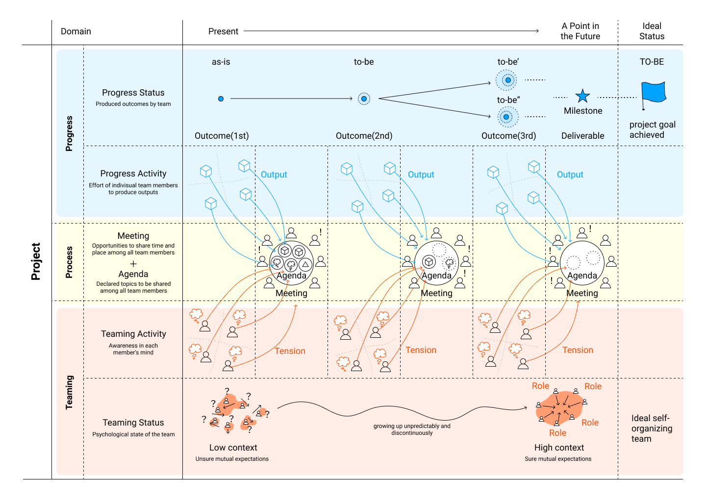

# Essentials

This document describes the core key concepts of Project Sprint.

## Principles of Project Sprint

In Project Sprint, the phenomena in a project are divided into the following three **domains**.

1. **Progress** : individual activities for the progress of the project (**progress activity**) and the progress status that indicates whether or not the goals defined in the project have been achieved (**progress status**).
2. **Teaming** : Individual activities for team formation (**teaming activities**) and the state that indicates whether an ideal team is being formed (**teaming status**).
3. **Process** : A mechanism for all members to synchronize in order to facilitate the execution and optimization of their respective activities.

By repeating the progress, teaming activities,and processes regularly or iteratively, the progress and teaming statuses can be brought closer to the ideal state.

##### Project Sprint Concept Image

## Status
The goal of the project is to bring the status of progress and teaming closer to the ideal state.

The project team aims to bring the progress status closer to **the achievement of the project goal**.This means incremental delivery of deliverables from the current point to the ideal endpoint of the project. By specifying specific points in the future, called milestones, we can be sure that we are on the right path to the final destination.The goal of the project is to bring the status of progress and teaming closer to the ideal state.

Progress status is ascertained by whether or not milestones have been achieved.

The project goal to be reached is initially set by one or more people with some expectations. However, they are not set in stone, and can always be rewritten and evolve as the project progresses. Nevertheless, the project goals should be specific enough to be able to define or modify milestones.

Project team aims to move the teaming status closer to **the ideal team formation**. This means that the team will grow, albeit unpredictably and discontinuously, from the current state of one team to the ideal team status. As the context between team members is explicitly and implicitly shared, they become more confident in their expectations of each other.

An ideal team is one in which project members clearly understand each other's responsibilities and have a set of expectations of each other, so that they can work autonomously. Autonomous means each person is able to make decisions about what they should do for the team and can actually act on them.

You can confirm the teaming status when all team members regularly **confirm each role**.

## Activity
Individual activities can be divided into the following two categories.

**Progress activities** are those in which each person completes **the tasks** assigned to him or her in order to make progress on the project, resulting in **the output** of the work. Outputs are **tangible things that you can see**.

**Teaming activity** is when each individual begins to have or recall thoughts about the project or the team as they spend time on the project, and from this comes a sense of discomfort (**tension**) that they want to convey to the other members. Tensions are specifically the gaps between the current situation and the better situation that each member thinks "it would be better if we did this", or small ideas, concerns, or worries.

## Process

Process is a mechanism specific to Project Sprint that allows individual activities to be reflected in the overall project results.

By repeating activities and processes regularly and iteratively, the progress status and teaming status will become ideal. The process itself does not have an ideal status, but it is optimized to be the most efficient and effective form to bring the two statuses closer to the ideal.

Process has two components: meeting and agenda.

**Meeting** is an opportunity for all team members to share space and time.

**Agenda** is a statement of the results of individual activities (outputs and tensions) to be shared with team members. An outcome or tension can only be explicitly recognized by all team members when it becomes an agenda.

By having all team members discuss the agenda together in a meeting, information that might otherwise remain within each individual can be synchronized at once.

Ultimately, the process yields the following results.

  * In the progress domain, the tasks of execution and optimization to achieve the goals of the project
  * In the teaming domain, execution and optimization tasks to form an ideal team
  * In the process domain, execution and optimization tasks to improve the mechanism itself.

## Role
The role that each person plays in Project Sprint is called **a role**. Each role can be played by more than one person. All team members are expected to take the initiative in introducing and implementing the Project Sprint.
