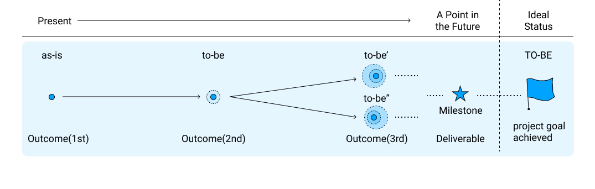

# Setting Goals and Milestones for a Project

The content of this article is the "progress domain" in Project Sprint.

The "ideal state" of the progress domain is the state in which the goals of the project have been achieved. Therefore, the first step is to define the goals of the project that you want to achieve in the future. Then, we define the deliverables needed to achieve the goal and the path to create the deliverables (called milestones).

## Defining Project Goals

First, what is the goal of the project you are working on? Is it to develop a new business concept and create new value? Or are you working to achieve a set value, such as improving the efficiency of a system? Either way, make sure you have a clear goal for your project.

Ideally, the goal should be created through discussion among all team members.

In practice, however, it is often the case that all the team members first exchange divergent opinions, and then someone else summarizes the contents and puts them into an explicit form.

In this case, the process of formulating is as follows

* Background of the project (relevant business plans, etc.)
* Preliminary knowledge of the project to be undertaken
* Constraints such as budget and deadline

It will be smoother if a person who has a deep understanding of the basic information surrounding the project.

This information should then be shared and elaborated upon by all team members in a clear form, and discussed until everyone is satisfied with the final result.

The goal should be specific enough to allow for the creation of milestones as described below. In other words, it must be specific enough that you can break down and visualize the specific deliverables and deadlines associated with them based on the stated goal.

If you are unable to create a goal, you may set up a preliminary project in which the goal itself is to create a goal and intensively study it. In this case, the milestone is to gather basic information surrounding the project (background of the project, prior knowledge about the project, and constraints), with the goal of making the goal explicit. Based on the clarified goal, set the original project milestones.

## Setting Milestones

A milestone is a description of a specific point in a project with a set of concrete deliverables and a deadline associated with it. Milestones are set as many times as necessary, counting backward from the goal of the project, and most often there are multiple milestones.

By referring to the milestones, the team can see what they need to do from the current point and what they should aim for afterwards.

Milestones, like goals, should be discussed and created by all team members.

In practice, however, it is often the case that all team members first express their opinions in a divergent manner, and then someone else summarizes the contents and puts them into an explicit form. Of course, in the end, everyone needs to be satisfied with the final result. Therefore, try to keep it as simple as possible so that everyone can easily understand it.

The level of granularity and abstraction of the milestones may vary depending on the distance from the goal. They will also vary from project to project. However, the milestones should be such that each team member who sees them can make decisions and take actions on their own. The milestones should be understandable to the team members directly involved in the milestone, and if there are multiple teams on the same project, the milestones should be viewable by other team members so that they can make decisions about the actions of each team member.

Also, some projects may have multiple milestones that are set in a multi-line fashion (this is called a "track", which is the same as a "track" for the definition of a track [See Tip 1](../tips/tips1.md).) In such cases, we need a granularity and abstraction level that allows us to determine the dependencies and influences among milestones.

Specifically, the description should be written in such a way that it is possible to adjust milestones in one track in order to achieve milestones in another track, or that other team members can spontaneously suggest, "I should provide this kind of output in order to achieve this milestone." In addition, you should be able to describe the project's goals and objectives to stakeholders outside the project.

Another criterion for setting appropriate milestones is whether or not it is objectively easy for stakeholders outside the project (e.g., people who need to be informed of the results of the project or people whose work will be affected by the results of the project) to understand what you are trying to achieve. This is one of the criteria for setting appropriate milestones.

Usually, the most recent milestones are more specific in terms of both due date and deliverables, while those closer to the goal are more abstract and rough.

If you are unable to create milestones, review your goals. As mentioned earlier, the goal needs to be specific enough to allow for milestones.

**Relationship between Goals and Milestones**

## Handling of Setting Goals and Milestones

The goals and milestones you set should be available to team members at all times.

This way, when team members perform a task during the project or discuss it among themselves, they can immediately check whether the milestone or the goal of the project beyond the milestone has been met.

Also, be aware that milestones and goals can be changed according to the situation. Milestones and goals can be changed at any time during the project, based on changes in the environment surrounding the project and what you learn as you actually complete the tasks.

The actual process of changing them is explained [in Reviewing a project's goals and milestones](3-2.md).

**Tips related to this page**

* [Useful ideas for organizing the project timeline (tracks/phases/events)](../tips/tips1.md)
* [Using the Milestone Map](../tips/tips2.md)
* [What kinds of things are produced in a project (outputs/artifacts)](../tips/tips3.md)
* [Preparing the project environment](../tips/tips4.md)
