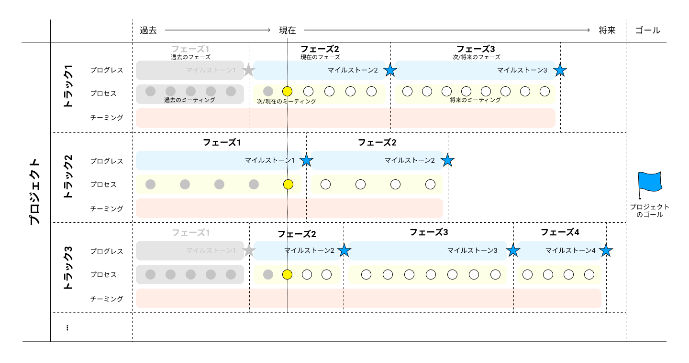

# プロジェクトの時間軸を整理するための便利な考え方（トラック/フェーズ/イベント)

プロジェクトスプリントではゴールとマイルストーンという概念を用いてプロジェクトの時間軸を整理することを基本としています。 この記事では、このゴールとマイルストーンに加え、チームメンバーがコミュニケーションをするうえで知っておくとよい概念を紹介します。

## **トラック - ゴールに対して複線的なマイルストーンの進行をしたいときの考え方**

**トラック/フェーズ概念図**

プロジェクトスプリントでプロジェクトのゴールとマイルストーンを設定してプロジェクトを進行するとき、最もシンプルな構造は、

* ゴール X
  * ゴールX を実現するための マイルストーン A-1
  * マイルストーン A-1 を実現するための、マイルストーン A-2
  * マイルストーン A-2 を実現するための、マイルストーン A-3

というものです。端的に時系列で表現すると、

**マイルストーン A-3 -> マイルストーン A-2 -> マイルストーン A-1 -> ゴールX**

というかたちで、プロジェクトが進行します。

しかし、実際にはこのように単純な構造でプロジェクトが進行することはほとんどありません。

例えば、次のようなときです。

* ゴールX
  * ゴールXを実現するためには、マイルストーンAと、マイルストーンBが必要
  * マイルストーンAは、3つのマイルストーンに分けて達成できる
  * マイルストーンBも、3つのマイルストーンに分けて達成できる

このとき、次のような時系列でゴールXが実現します。

**マイルストーン A-3 -> マイルストーン A-2 -> マイルストーン A-1**

**マイルストーン B-3 -> マイルストーン B-2 -> マイルストーン B-1**

**マイルストーン A-1 + マイルストーン B-1 -> ゴール X**

マイルストーンAを作る流れとマイルストーンBを作る流れのことを、それぞれ「トラック」と呼びます。

例えばあるWebサイトを立ち上げるプロジェクトを考えたとき（ゴールはWebサイトの完成）、Webサイトのデザインを考えるチームと、Webサイトのシステム環境を整える作業は（関連はしながらも）並行して進行します。このとき、それぞれの作業領域を「トラック」として分割し、トラックごとにマイルストーンを分けて考えることで、よりプロジェクトを構造化して捉えられるようになります。

なお、進捗状況の共有やマイルストーンの詳細な確認などを目的として、トラック間での連携やトラックを横断したミーティングが必要になることがあります。このとき、連携が必要かどうかを検討・判断するのはプログレスリードですが、ミーティングのアレンジはミーティングロールとしてのファシリテーターが担当します。

## **フェーズ - マイルストーンとマイルストーンの間の意味的な位置づけ**

例えば「新規事業を立ち上げる」というゴールを持ったプロジェクトがあり、このために次のようなマイルストーンを設定したとします。

* マイルストーン1 外部環境、自社や競合他社の状況に関する調査書の完成
* マイルストーン2 調査書に基づいた新規事業計画書の作成
* マイルストーン3 新規事業計画書に基づいた、実際に事業を立ち上げることのできる環境づくり

これらのマイルストーンを順に実行することによって、ゴールが達成できます。マイルストーンは成果物と紐づく必要があるので、このような書き方になります(調査書、新規事業計画書、事業を立ち上げることのできる環境、がそれぞれ成果物です）。

しかし、プロジェクトでのコミュニケーション上は、「いま自分たちは何をしているのか」を表現できたほうが便利です。このそれぞれを、「フェーズ」と呼びます。つまり、この例では、

* マイルストーン1を達成するまでの間：調査フェーズ
* マイルストーン2を達成するまでの間：企画フェーズ
* マイルストーン3を達成するまでの間：実現フェーズ

などと呼ぶことができます。

フェーズの名称は、ゴールに向けたマイルストーン全体の中でそのフェーズがどういう位置づけなのかが分かるものにします。また、自分たちのチームはもちろん、プロジェクト内の他チームのメンバーから見たときにも何をするのかが分かりやすく記載されていることが重要です。

## **イベント - マイルストーンやゴールに影響を与える外部条件**

プロジェクトの外部環境にあって、プロジェクトに影響を与えるためプロジェクトメンバーが意識しなければならないものを、「制約」と呼びます。特に、マイルストーンやゴールに影響を与えたり、その設定の前提となったりするものを「イベント」と呼びます。なお、プロジェクトの内部にあってマイルストーンやゴールの変動をもたらすものは、プロジェクトの一部として捉え、イベントとは呼びません。

イベントの典型的な例は、プロジェクトの外で日々行われている、組織の定常業務です。具体的には取締役会などがこれにあたります。これ自体がプロジェクトの成果物を生み出すわけではありませんが、プロジェクトに関する何らかの報告や決済がなされるため、こうしたイベントに合わせてマイルストーンを設定する必要があることがあります。また、こうしたイベントからフィードバックされた情報がプロジェクトの前提条件を変え、マイルストーンや、ときにはゴールそのものを変える必要が生じることもあります。

単発のものや定期的なものだけでなく、「商戦期」のような期間をもったものも、イベントとして認識します。それに合わせてプロジェクトのマイルストーンを設定したり、その結果を受けてマイルストーンやゴールを調整したりする必要があるという点は、特定の日付であっても期間であっても変わらないからです。
