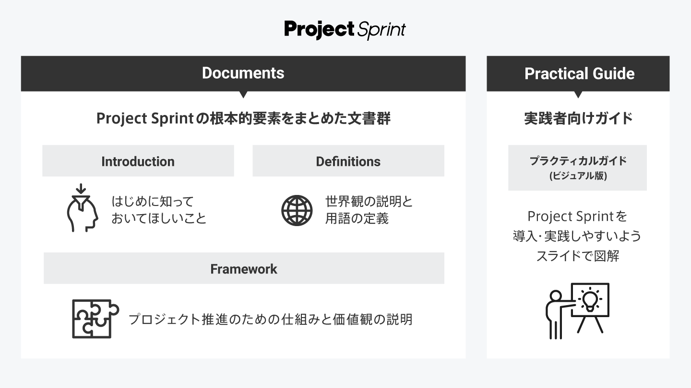

# v4.3

## 文書構成

* [**Introduction**](introduction.md)  
  はじめにお読みいただきたい文書です。Project Sprint からの提案の概要を紹介した上で、その基盤となっている価値観を簡単に紹介します。
* [**Definitions**](definitions.md)  
  Project Sprint を理解するための前提を示す文書です。Project Sprint におけるプロジェクト観を説明し、その他の用語を定義します。
* [**Framework**](framework.md)  
  Project Sprint の核となる概念や価値観を示す文書です。Project Sprint におけるプロジェクト推進の構造と、そのための価値観や推奨される振る舞いが記述されています。

## その他のコンテンツ

* [**Practical Guide**](../../../practical-guide/CODEv4_based/README.md)  
Project Sprint のフレームワークを実際のプロジェクトに導入し使いこなすためのガイドブックです。Project sprint の原理をビジュアル化して分かりやすく解説した Miro や、追加で理解しておくとよいドキュメント群が含まれます。

★Project Sprint の内容に疑問やご意見を持たれた方は、[こちら](https://github.com/copilot-jp/project-sprint/discussions)のGitHub Discussionへお寄せください。
