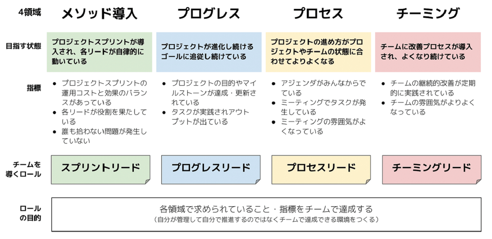

# 実務で使いやすいロールの設定

プロジェクトスプリントでは、ミーティングロール以外には必ず設定しなければならないロールというものを決めておらず、ロールの定義についてはチームメンバーで合意することのみが必要な条件となっています。

ただし、次の表のようなロールについては、実務上よく使われることを見越して、あらかじめ用意されています。 特にプロジェクトスプリントを初めて導入する場合、これらのロールを利用することによって、導入をスムーズに行うことができます。

**プロジェクトスプリントの4領域と、それぞれに必要なロール**

それぞれのロールで使われている「リード」という言葉には、理想的な状態へチームを引っ張っていくという意味合いが込められています。独力でプロジェクトを管理したり推進したりするのではなく、各領域で求められていることや指標をチーム全体で達成できる環境を作ることが、「リード」の役割です。必ずしも組織における管理職や上位の人しかこのロールを担当できないというわけではありません。

### **スプリントリード**

スプリントリードは、プロジェクスプリントの導入を行うロールです。具体的には、プロジェクトスプリントのCODEに書かれている手法をチームメンバーへ説明したり、実際にプロジェクトスプリントの準備と実践を主導することが期待されます。

**各ドメインをリードするロール**

### **プログレスリード**

プロジェクトのゴールとマイルストーンの達成をリードするためのロールです。アウトカムや成果物作成の進捗管理を行ったり、進捗を達成するために効果的・効率的な最適化の方法を検討してプロジェクトの活動に取り入れたりします。

### **プロセスリード**

プロジェクトの各スプリントにおけるプロセスが正しく機能していること、とりわけミーティングが最適に運用される状態の維持・向上をリードするためのロールです。ミーティングの準備と実践が効果的・効率的に行われるための活動を行います。

### **チーミングリード**

「チームの状態を現状よりよくすること」をリードするためのロールです。チームのロールの明文化、新たなロールが発生したときやロールに変更があったときの調整、といった活動を担当し、自律的で理想的なチームの形成をリードします。
