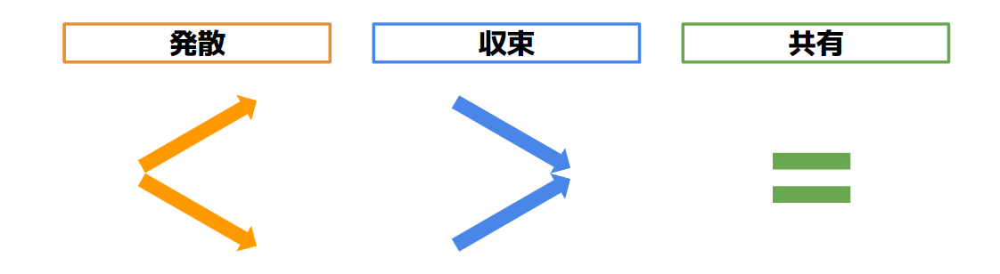

# アジェンダとは

アジェンダとは、個人から出力されたアイデアや問題を、他のメンバーと共有し次の行動を決定するために明文化したものです。ミーティングに提出され議論される個々のアジェンダを、アジェンダアイテムと呼びます。

## アジェンダアイテムの目的

アジェンダアイテムは、議論の目的によって次の三つの種類に分けられます。

* 発散：議論を通して幅広い選択肢が出てくる。結論が見えないテーマについて議論し、明確でないまま終了してよい。
* 収束：議論を通していくつか選択肢から一つの選択肢に絞られる。メンバー間での意思決定や合意形成など、最終的に何かしらの結論を出す。
* 共有：情報共有や前提確認など、チームメンバーと認識を合わせる。議論を特に必要としない。

個々のアジェンダアイテムがどれに分類されるのかあらかじめ示しておくことで、ミーティングの参加者が「どのような視点で」「どのような発言をするべきか」を理解することができます。例えば、「発散」のアジェンダアイテムであれば自由に意見を発してよく、新しいアイデアを出すことが重要だと分かります。反対に「収束」のアジェンダアイテムであれば、マイルストーン達成のためにどのようなアウトプットをつくっていくべきか、現実的な結論を導くことが必要だと分かります。また「共有」のアジェンダアイテムであれば、疑問点を質問しできるだけ認識を合わせることが重要だと分かります。
