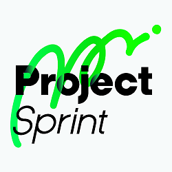

# Ja v4.0.0

## [Introduction](introduction.md)

Introductionは、Project Sprint の目的と構成を説明し、Frameworkの内容を理解するにあたって重要となる前提や用語を把握するために置かれています。

## [Framework](framework.md)

Frameworkは、Project Sprint の核となる概念や価値観を示すものです。プロジェクトに取り組むに当たってのものごとの捉え方・考え方や推奨される振る舞い、何に価値を置くとよいかが記述されています。

v4.0では、Project Sprint がこれまでも重視してきた「作成物を生む」という行為により重点を置き、プロジェクトを「出力」と「成果」の関係から捉えなおしました。このことにより、以下のような効果を期待しています。
- 作成物を小さく確実に生み出し続けることを重視することで、プロジェクトの推進と最適化がよりスムーズに行えるようになる
- 出力を成果との1対1の対応関係から解き放ち、より幅広く価値を生み出すことができるようにする
- バックキャスト型・フォアキャスト型両方のプロジェクトに対応できるようになる
- プロジェクトをよりチームメンバー全員のものとして捉えることができるようになる

★Project Sprint の内容に疑問やご意見を持たれた方は、[こちら](https://github.com/copilot-jp/project-sprint/discussions/381)のGitHub Discussionへお寄せください。
