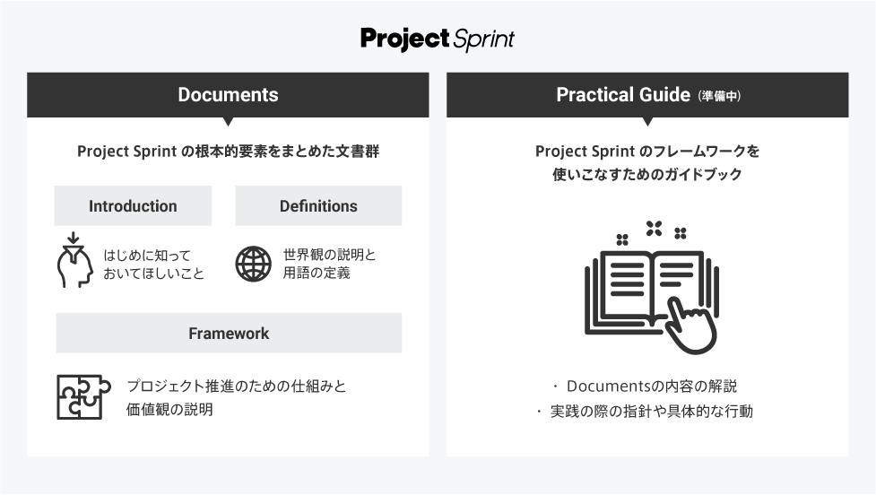

# v4.0

## [Introduction](introduction.md)

Introduction では、Project Sprint からの提案の概要を紹介した上で、その基盤となっている価値観を簡単に紹介します。

## [Definitions](definitions.md)

Definitionsでは、Project Sprint を理解するための前提となる、Project Sprint におけるプロジェクト観を説明し、その他の用語を定義します。

## [Framework](framework.md)

Frameworkは、Project Sprint の核となる概念や価値観を示すものです。Project Sprint におけるプロジェクト推進の構造と、そのための価値観や推奨される振る舞いが記述されています。

v4では、Project Sprint がこれまでも重視してきた「作成物を生む」という行為により重点を置き、プロジェクトを「出力」と「成果」の関係から捉えなおしました。このことにより、以下のような効果を期待しています。

* 作成物を小さく確実に生み出し続けることを重視することで、プロジェクトの推進と最適化がよりスムーズに行えるようになる
* 出力を成果との1対1の対応関係から解き放ち、より幅広く価値を生み出すことができるようにする
* 予測型・適応型両方のプロジェクトに対応できるようになる
* プロジェクトをよりチームメンバー全員のものとして捉えることができるようになる

★Project Sprint の内容に疑問やご意見を持たれた方は、[こちら](https://github.com/copilot-jp/project-sprint/discussions)のGitHub Discussionへお寄せください。
