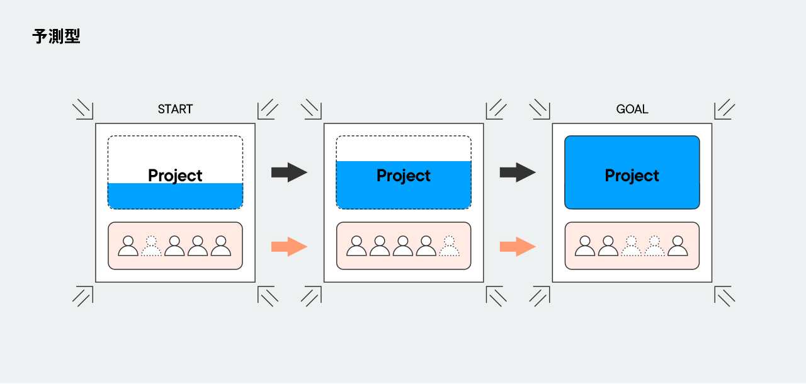
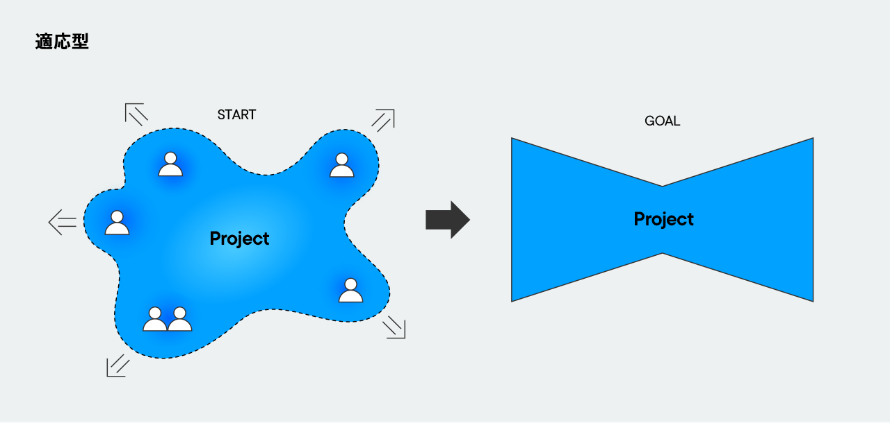

# Definitions

ここでは、Project Sprint を理解するための前提として、Project Sprint のプロジェクト観を説明し、その他の用語を定義します。

## 1. Project Sprint のプロジェクト観

環境の変化の少ない時代においては、当初の条件を不変のものとしてプロジェクトを定義したり計画したりすることができました。しかし環境の変化が激しく不確実性の高い現代においては、すべての活動は取り組んでみないと誰にも把握できないものであり、当初の条件や見通しは当然に変化するものであると捉えなくては、プロジェクトの本質的な成功に近づくことができません。

そのためProject Sprint では、プロジェクト全体を一気に定義したり計画したりするのではなく、小さく切り分けて捉え、そのひとつひとつのフェーズにおいてどのようなアプローチを取りどう行動するのが適切かをプロジェクトチームが決めていくのがよいという考え方を取っています。

この考え方を取り入れるために読者の方と共有したいプロジェクト観を、以下の3つの特徴から説明します。

**i) なにに基づいてプロジェクトを定義するか**

Project Sprint において、プロジェクトはプロジェクトチームの意思に基づいて定義されます。

Project Sprint では、まずプロジェクトチームが自由な主体としてその意思に基づいてプロジェクトを定義し、その後もプロジェクトチームによる再定義を繰り返しながらプロジェクトを推進していくと捉えます。この捉え方は、Project Sprint の主柱をなすものであり、Project Sprint をもっともよく特徴づけるものでもあります。

最終的に達成すべき成果をはじめから所与の条件と捉え、それに規定された「プロジェクト」を活動の固定的な枠組みとして受け入れることもできます。しかしそういった場合、プロジェクトチームはあくまで、与えられた定義や枠組みに従ってプロジェクト達成の条件を満たすために活動する、プロジェクトの構成要素のひとつでしかありません。そのため、プロジェクトメンバーという生身の人間たちが日々感じるプロジェクトの現場での状況や小さな気付き、そしてプロジェクトチームの個性は、プロジェクトの枠組みや推進過程に十分に反映されず、プロジェクトチームの行動に不自由さが生じることがありました。

Project Sprint は、この不自由さを解消するために、制約ありきではなくプロジェクトチームの意思ありきのプロジェクト観を提案します。

Project Sprint におけるプロジェクトチームは、プロジェクトに対する所与の条件にそのまま従う参加者ではなく、プロジェクトを取り巻く制約を意思を持って解釈し納得した上でプロジェクトを定義する主体でなくてはなりません。そのことにより、プロジェクトチームはプロジェクトの実行主体として、プロジェクトを構想し定義しつづけていく責任とプロジェクト外部の環境の変化を捉えつづけていく責任、さらに外部のステークホルダーと自ら調整を行っていく責任を負うことになります。それはときに、プロジェクトチームにとって大きな挑戦になるかもしれません。

しかし、このプロジェクト観により、プロジェクトチームは固定的な枠組みに押し込められることなく、自らの意思で自由にプロジェクトを定義し、環境の変化を柔軟に捉えながら自律的にプロジェクトを推進することができるようになります。

**ii) どのようにプロジェクトへのアプローチを選択するか**

Project Sprint において、プロジェクトへのアプローチはその時々のプロジェクトの状態に応じて自由に選択されます。

プロジェクトへのアプローチには、大きく分けて予測型（ウォーターフォール）と適応型（アジャイル）の二つがあります。予測型のアプローチでは、変化の少ない環境を前提とし、予め設定した最終成果を目指してロードマップを組み立て、それに従ってプロジェクトを進めます。一方適応型のアプローチでは、環境は変化するものだということを前提とし、その変化に応じて能動的に最終成果とロードマップを変化させながら進んでいきます。

　

個々のプロジェクトについて予測型なら予測型、適応型なら適応型で進めるものと捉えることもできます。しかし、ひとつのプロジェクトの中でも、工程が予め明確になっており予測型で計画的に進めることができる部分と、未知の部分が多く適応型で柔軟に進めたほうがよい部分が混在することが多いものです。また、予測型と適応型はそもそも二項対立で切り分けられるものではなく、予測型と適応型の間には変化への能動性において無数のパターンがグラデーション状に存在します。

そのため Project Sprint は、プロジェクトへのアプローチを固定せず、状況に応じて適切なアプローチを柔軟に選択できるプロジェクト観を提案します。

プロジェクトチームは、自らプロジェクトの状態を判断し、そのときの状況に最も適したアプローチを選択します。そのことにより、ロードマップの詳細さや厳密さに強弱をつけながら、効率的にプロジェクトを推進することができるようになります。

**iii) どのようにプロジェクトを進めるか**

Project Sprint において、プロジェクトは小さな実験の繰り返しとして進められます。

最終的に達成すべき成果のために必要な要素を小さな成果に分割し、分割したひとつひとつの成果に対して仮説を立案して実行した上で、その検証をもとに以降のフェーズの軌道修正を行います。こうして反復的かつ漸進的にプロジェクトを進めていくのです。

プロジェクトにおける最終的な成果の達成までの一連の流れを、できるだけ失敗や手戻りが生じないように計画的に推進していこうと考えることもできます。しかし、計画を綿密に立ててもその後大幅に修正が必要になったり、プロジェクト全体を同じ精度で捉えつづけようとすることでメンバーの認知負荷が高くなりすぎたりすることもあります。

そのためProject Sprint では、仮説の設定とその仮説に沿った行動を、短いタイムスパンで小さく実験的に繰り返すという進め方を取ります。

個々の実験において重要なのは実験結果を振り返って次のフェーズに生かすことであって、仮説が正しかったかどうかはさほど重要なことではありません。「正しい仮説を立てる」ことにこだわって行動の速度が鈍ったり保守的になったりするよりは、「取り組んでみることで見えてくるものもある」と捉えて前向きに挑戦し、得られた結果を次のフェーズの改善材料にしていくのです。また、仮説が間違っていたとしても、実験の結果がプロジェクト全体の成功につながる成果を実現することもあります。ただし、行動を起こしやすく軌道修正を容易にするため、個々の実験のサイズは小さければ小さいほどよいということに留意する必要があります。

このようにプロジェクトを進めることで、プロジェクトチームは、創造性豊かに小さな挑戦を重ね、仮説を検証して小さく軌道修正を繰り返すことで、複雑な問題を素早く解決して最終的な成果に向けてプロジェクトを推進していくことができます。

## 2. 用語集

Project Sprint におけるプロジェクトは、プロジェクトチームの出力によって成果が生み出され、その成果が外部に提供できる価値となることにより達成されます。以下の用語は、Project Sprint の前提を理解し、Framework の記述をスムーズに読み進めるために定義したものです。

- **プロジェクトチーム**  プロジェクトに対する共通認識をもち、その達成に向けて相互に協力し合うメンバーの集まり。プロジェクトを定義・再定義することのできる、プロジェクトの実行主体。

- **プロジェクト**　プロジェクトチームが、外部に何らかの価値を提供するために実行する活動。プロジェクトチームは、プロジェクトの実行主体としてプロジェクトを構想し定義しつづけていく責任と、外部のステークホルダーに対する説明責任を負う。

- **プロジェクトゴール**　プロジェクトチームが、プロジェクトにおいて最終的な達成を目指すもの。目的・成果・期日という3つの要素をもつ。

- **フェーズ**　プロジェクトゴールをいくつかの成果に分解したとき、個々の成果とそれを達成すべき期日が属する、プロジェクト内の一定の段階。

- **ロードマップ**　チームが次の行動を決定するための指針として、プロジェクトにおいて達成すべき成果やタスクを時系列でマッピングしたもの。

- **価値**　プロジェクトの外部に存在するステークホルダーが、プロジェクトチームによる成果を意味や有用性があると認識して受け取ったもの。価値の有無や軽重は最終的にステークホルダーの認識に委ねられるため、プロジェクトチームが認識する価値はあくまで仮説的なものである。

- **成果**　チームが、プロジェクトやプロジェクト内の一定のフェーズで達成を目指し、最終的に生み出すもの。具体的な成果物と、達成したい状態としてのあるべき姿の両方を含む。

- **成果物**　プロジェクトやプロジェクト内の一定のフェーズを完了するために必要な作成物。プロジェクトチームにとって、成果の実現に資すると認識できるものでなければならない。

- **出力**　チームメンバーが作成物を産出すること。

- **作成物**　チームメンバーによって生み出され、チームに対して共有されて他のチームメンバーが意見を述べたり助言をしたりといったリアクションを取ることが可能な、かたちあるもの。

- **実験**　行動を起こしやすく軌道修正が容易な規模で行われて次の行動の改善材料となる、作成物の産出を伴う成果の仮説構築・実行・検証のサイクル。

- **定例会議**　チームメンバーが、自身の行動を自己決定する際の前提を得るために他者と同期することを求めて、定期的・反復的に集まる機会。個々の定例会議が終わった時点で各メンバーが自身の次の行動を自己決定できる状態になっていることを目指して、認識合わせ、問題の共同解決、アイデアの共同創造、意思決定などを行う。
