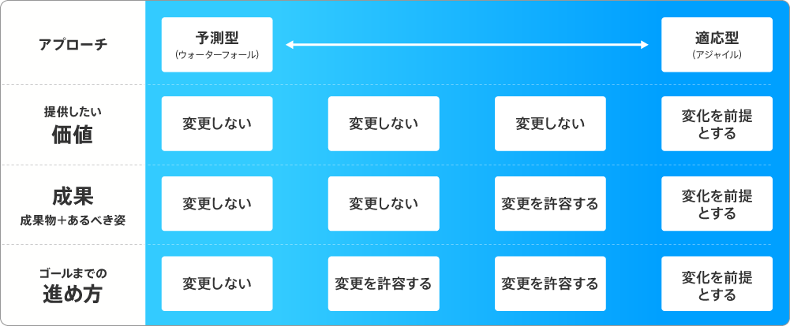
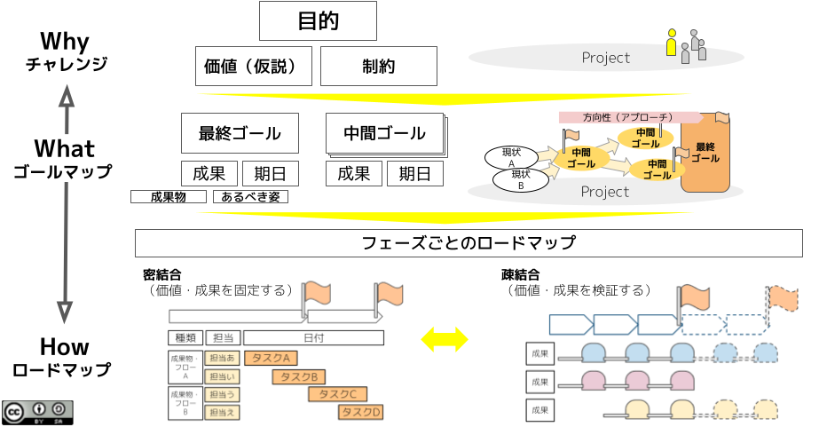

# Definitions

Project Sprint は、プロジェクトチーム自らがプロジェクトの主体となり、小さな成果を繰り返し確実に生み出すことを通じて、環境の変化を捉えつづけながら自律的にプロジェクトを推進するためのフレームワークです。

この Definitions では、Project Sprint を理解するための前提として読者の皆さんと共有したい、Project Sprint の世界観やプロジェクトの捉え方を説明し、その他の用語を定義します。

## 1. Project Sprint におけるプロジェクト

プロジェクトは、社会に変化をもたらすためにチームが自発的に行う活動です。

具体的には、次のような特徴をもつ活動が「プロジェクト」であるとProject Sprint では考えています。

- 短く期間を区切った探索的な活動が、反復継続される
- チームに環境の変化を捉えつづける意思がある

とはいえ、これは必要最低限の要素であり、個別具体的な活動がこの特徴にあてはまるかどうかや、 Project Sprint のフレームワークを導入するのに適しているかどうかは、なかなか判断が難しいものです。

判断を助けるために、Project Sprint におけるプロジェクトの捉え方と相反する活動を以下に挙げておきます。こういった活動は、Project Sprint のフレームワークよりも適した進め方が他に存在したり、Project Sprint のフレームワークを取り入れることが構造上困難であったりするものと言えます。

- 環境の変化を考慮しなくてよい活動
  - 3か月で完全に終了しチームが解散してしまうなど、活動自体が短期間で終了し非連続的である
  - 成果物やゴールまでの過程が詳細に決まっているなど、不確実性が高くなく全体を計画することができる
- 環境の変化に即して行動できない活動
  - チームに決定権がなく承認プロセスに時間がかかるなど、素早い意思決定ができない
  - チームに環境の変化を捉えつづけようとする意思がない

## 2. Project Sprint の世界観

**i) プロジェクトチームの意思にもっとも重きを置く**

Project Sprint において、プロジェクトはプロジェクトチームの意思に基づいて定義されます。

Project Sprint では、まずプロジェクトチームが自由な主体としてその意思に基づいてプロジェクトを定義し、その後もプロジェクトチームによる再定義を繰り返しながらプロジェクトを推進していくと捉えます。この捉え方は、Project Sprint の主柱をなすものであり、Project Sprint をもっともよく特徴づけるものでもあります。

最終的に達成すべき成果をはじめから所与の条件と捉え、それに規定された「プロジェクト」を活動の固定的な枠組みとして受け入れることもできます。しかしそういった場合、プロジェクトチームはあくまで、与えられた定義や枠組みに従ってプロジェクト達成の条件を満たすために活動する、プロジェクトの構成要素のひとつでしかありません。そのため、プロジェクトメンバーという生身の人間たちが日々感じるプロジェクトの現場での状況や小さな気付き、そしてプロジェクトチームの個性は、プロジェクトの枠組みや推進過程に十分に反映されず、プロジェクトチームの行動に不自由さが生じることがありました。

Project Sprint は、この不自由さを解消するために、制約ありきではなくプロジェクトチームの意思ありきのプロジェクト観を提案します。

Project Sprint におけるプロジェクトチームは、プロジェクトに対する所与の条件にそのまま従う参加者ではなく、プロジェクトを取り巻く制約を意思を持って解釈し納得した上でプロジェクトを定義する主体でなくてはなりません。そのことにより、プロジェクトチームはプロジェクトの実行主体として、プロジェクトを構想し定義しつづけていく責任とプロジェクト外部の環境の変化を捉えつづけていく責任、さらに外部のステークホルダーと自ら調整を行っていく責任を負うことになります。それはときに、プロジェクトチームにとって大きな挑戦になるかもしれません。

しかし、このプロジェクト観により、プロジェクトチームは固定的な枠組みに押し込められることなく、自らの意思で自由にプロジェクトを定義し、環境の変化を柔軟に捉えながら自律的にプロジェクトを推進することができるようになります。

**ii) 状況に応じて最適なアプローチを自由に決定する**

Project Sprint では、どのようなアプローチでプロジェクトを進めるかをその時々の状況に応じて自由に選択することができます。

プロジェクト進行のアプローチには、大きく分けて予測型（ウォーターフォール）と適応型（アジャイル）の二つがあります。

予測型は、変化の少ない環境を前提とし、予め設定した最終ゴールを目指してロードマップを組み立て、それに従ってプロジェクトを進めるというアプローチです。予測型で進められるプロジェクトは図1-1のように、プロジェクトの大枠が固定されており、達成すべきゴールはプロジェクト開始時点から明確です。プロジェクトチームはそれらの要求に応じた計画を立て、ゴールに向かって順を追って成果を積み上げていきます。

　

一方適応型は、環境は変化するものだということを前提とし、その変化を捉えて能動的に最終ゴールとロードマップを変化させながら進んでいくというアプローチを取ります。適応型で進められるプロジェクトは図2-2のように、不確実性と変動性が高く、プロジェクト開始時点では最終ゴールすらも曖昧模糊としたものです。反復的・漸進的な取り組みの中で、ゴールやロードマップの詳細化・明確化が行われます。

個々のプロジェクトについて、予測型なら予測型、適応型なら適応型で進めるものと捉えることもできます。しかし、ひとつのプロジェクトの中でも、工程が予め明確になっており予測型で計画的に進めることができる部分と、未知の部分が多く適応型で柔軟に進めたほうがよい部分が混在することが多いものです。また、予測型と適応型はそもそも二項対立で切り分けられるものではなく、予測型と適応型の間には変化への能動性において無数のパターンがグラデーション状に存在します。

そのため Project Sprint は、プロジェクトへのアプローチを固定せず、状況に応じて適切なアプローチを柔軟に選択できるハイブリッド型のプロジェクト観を提案します。

プロジェクトチームは、自らプロジェクトの状態を判断し、そのときの状況に最も適したアプローチを選択します。そのことにより、ロードマップの詳細さや厳密さに強弱をつけながら、効率的にプロジェクトを推進することができるようになります。

**iii) 探索的な小さな実験の繰り返しとしてプロジェクトを進める**

Project Sprint において、プロジェクトは小さな実験の繰り返しとして進められます。

最終的に達成すべき成果のために必要な要素を小さな成果に分割し、分割したひとつひとつの成果に対して仮説を立案して実行した上で、その検証をもとに以降のフェーズの軌道修正を行います。こうして反復的かつ漸進的にプロジェクトを進めていくのです。

プロジェクトにおける最終的な成果の達成までの一連の流れを、できるだけ失敗や手戻りが生じないように計画的に推進していこうと考えることもできます。しかし、計画を綿密に立ててもその後大幅に修正が必要になったり、プロジェクト全体を同じ精度で捉えつづけようとすることでメンバーの認知負荷が高くなりすぎたりすることもあります。

そのためProject Sprint では、仮説の設定とその仮説に沿った行動を、短いタイムスパンで小さく実験的に繰り返すという進め方を取ります。

個々の実験において重要なのは実験結果を振り返って次のフェーズに生かすことであって、仮説が正しかったかどうかはさほど重要なことではありません。「正しい仮説を立てる」ことにこだわって行動の速度が鈍ったり保守的になったりするよりは、「取り組んでみることで見えてくるものもある」と捉えて前向きに挑戦し、得られた結果を次のフェーズの改善材料にしていくのです。また、仮説が間違っていたとしても、実験の結果がプロジェクト全体の成功につながる成果を実現することもあります。ただし、行動を起こしやすく軌道修正を容易にするため、個々の実験のサイズは小さければ小さいほどよいということに留意する必要があります。

このようにプロジェクトを進めることで、プロジェクトチームは、創造性豊かに小さな挑戦を重ね、仮説を検証して小さく軌道修正を繰り返すことで、複雑な問題を素早く解決して最終的な成果に向けてプロジェクトを推進していくことができます。

## 3. 用語集

このセクションの用語は、Project Sprint の前提を理解し、Framework の記述をスムーズに読み進めるために定義したものです。

図3は、用語の全体像をおおまかに示したものです。個々の用語の詳細や相互の関係については、[Framework](framework.md) などで別途記述されます。

- **プロジェクトチーム**　プロジェクトに対する共通了解をもち、プロジェクトの達成に向けて相互に協力し合うメンバーの集まり。プロジェクトにおける唯一の決定権者かつ実行主体として意思を持ち、プロジェクトを定義しつづけていく責任と、プロジェクト外部のステークホルダーとの調整を行う責任を負う。

- **プロジェクト**　プロジェクトチームが、プロジェクト外部の社会に何らかの変化や価値を提供するために、自発的に行う活動。

- **ゴール**　プロジェクトチームが、プロジェクト内の一定のフェーズにおいて目的とする到達点。要素として成果と期日をもつ。プロジェクト自体の到達点を最終ゴールと呼び、プロジェクト内におおまかに置かれた中間到達点を中間ゴールと呼ぶ。

- **フェーズ**　プロジェクトチームが、ある目的をもって活動する期間。

- **ロードマップ**　プロジェクトチームが次の行動を決定するための指針として、各フェーズにおいて達成すべき成果やタスクを時系列でマッピングしたもの。

- **価値**　プロジェクトにおける成果のうち、プロジェクトチームがプロジェクト外部のステークホルダーにとって意味や有用性があると認識して提供する便益。価値の有無や軽重の評価はステークホルダーの認識に委ねられるため、プロジェクトチームが認識する価値はあくまで仮説である。

- **成果**　プロジェクトチームが、プロジェクトやプロジェクト内の一定のフェーズを完了させるために必要であると認識して生み出すもの。有形的・定量的なものや値である「成果物」と、定性的な状態である「あるべき姿」の両方を含む。

  - **成果物**　出力・作成されることで成果を達成したと判断できる、有形的なものや定量的な値。

  - **あるべき姿**　その状態に至ることで成果を達成したと判断できる、状態や定性的な捉え方。

- **出力**　チームメンバーが作成物を産出すること。

- **作成物**　チームメンバーによって生み出され、チームに対して共有されて他のチームメンバーが意見を述べたり助言をしたりといったリアクションを取ることが可能な、かたちあるもの。

- **実験**　行動を起こしやすく軌道修正を容易にするため、相対的に小さな規模で行われて次の行動の改善材料となる、作成物の産出を伴う成果の仮説構築・実行・検証のサイクル。

- **定例会議**　プロジェクトチームが、短期的・定期的なサイクルで反復的に実施する対話。各メンバーが自身の次の行動を自己決定できる状態を目指して他のメンバーと同期し対話を行い、共通了解の形成、問題の共同解決、アイデアの共同創造、意思決定などを行う。
