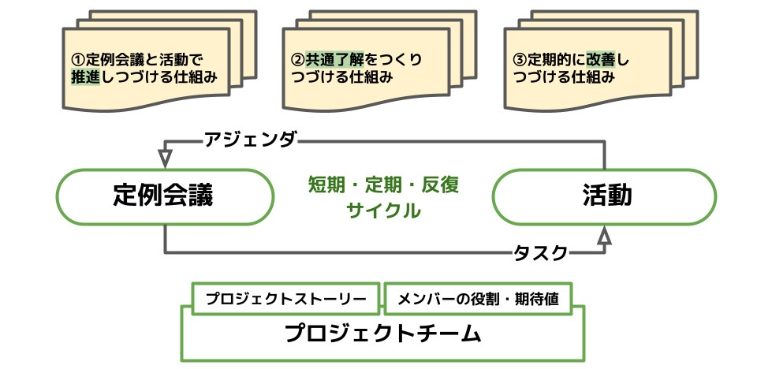

# Framework

## 1. Project Sprint は何を可能にするか

Project Sprint は、個々のメンバーの意思と相互の信頼関係を前提に、価値の創出を目指して協働する自律的な主体でありたいプロジェクトチームのためのフレームワークである。

Project Sprint の考え方を取り入れることで、プロジェクトチームはプロジェクトをより主体的に定義し、プロジェクトの中でより自由に振る舞い、より柔軟に選択し、より創造的に成果を生み出すことができるようになる。

このフレームワークは、プロジェクトチームが創造性豊かに小さな挑戦を重ね、仮説を検証して小さく軌道修正を繰り返すことで、複雑な問題を素早く解決して最終的な成果に向けてプロジェクトを進められるようにするためのものである。

## 2. Project Sprint におけるプロジェクト推進の構造

Project Sprint では、プロジェクトチームが実験を繰り返し小さな成果を生み出しつづけることを通して、プロジェクトの最終的な成果の実現に徐々に、そして着実に近づいていくことを、「プロジェクトの推進」と定義する。

そのためにプロジェクトの中では、プロジェクトゴールに至るまでの道のりを大小の成果の積み重ねの仮説として構築し、ひとつひとつの成果に対して実際に作成物を生み出してみて検証するという探索的な小さな実験が、プロジェクトチームによって繰り返し行われる。

プロジェクトを円滑に推進するためには、プロジェクトチームが自律的であることが重要である。チームとしての一貫性を前提に各メンバーが自発的に活動することで、必要な行動を自己決定して素早く実践し、結果を検証することができる。

## 3. Project Sprint におけるプロジェクトの認識

Project Sprint においては、便宜上プロジェクトをプログレス、チーミング、プロセスという3つのドメインに分けて認識する。プロジェクトにおける個々の実践を、これらの3つの側面それぞれから解釈することで、個々の実践がプロジェクトの中で持つ意義や効果をより正確かつ多面的に認識できる。この認識をプロジェクトチームで共有することにより、個々のメンバーは実践に対する各自の具体的な行動を必要に応じて自律的に最適化することができるようになる。

以下の表は、それぞれの側面における認識のしかたを整理したものである。

|                                 | プログレス                                                                   | チーミング                                                                       | プロセス                                                                                                   |
| ------------------------------- | ----------------------------------------------------------------------- | --------------------------------------------------------------------------- | ------------------------------------------------------------------------------------------------------ |
| 何に焦点を当てるか                       | 成果                                                                      | チームメンバー相互の関係                                                                | 定例会議                                                                                                   |
| 何を目指すか                          | 成果の実現                                                                   | 自律的なプロジェクトチームの形成                                                            | プロジェクトを推進・改善しやすい環境の構築                                                                                  |
| 
どのような観点から プロジェクトを捉えるか
 | 最終的な成果を達成するまでの行程を小さな成果の積み重ねに細分化して、軌道修正を繰り返しながら徐々に達成する                   | メンバー相互の信頼関係をベースに、チームの一貫性と個人の自律性をもちチーム全員で進める                                 | 定例会議を起点にした環境構築により実験とフィードバックのサイクルを習慣化・活性化させ、プロジェクトやプロジェクトチームの状態をよりよくする                                  |
| 重視される実践                         | 
成果の進捗・達成 成果の仮説の設定と更新
                                          | 
価値・成果の認識共有と納得 各自の責任・役割の自覚と引き受け
                                    | 
各自の出力による作成物やアイデアの共同創造 定例会議での問題の共同解決
                                                          |
| 重視される価値観                        | 
<strong>反復的・漸進的</strong>な成果の実現 環境の変化への<strong>能動的な追従</strong>
 | 
メンバー相互の<strong>信頼関係</strong>の構築 <strong>チーム全員によるプロジェクト推進</strong>
 | 
各メンバーの<strong>自己決定</strong>による自律的な行動 <strong>定期的・反復的</strong>な同期、<strong>継続的・漸進的</strong>な改善
 |

以下に、各側面からみたプロジェクト推進の構造を詳述する。

## 4. 実験の構造 - プロセス

### 4.1 出力を軸にした活動と対話

プロジェクトは、活動と対話の短期的・定期的な反復によって推進される。そのサイクルを維持する要となるのは、チームメンバーが作成物を産出すること、すなわち**出力**である。活動によって出力をもたらすことと、具体的な出力に伴って得られた気づきを用いて対話を行うことが重要である。

* **活動** : ① 各メンバーが、自ら**納得**した上で行動を起こす ② 行動により具体的な**作成物**を生み出し、その過程で気づきを得る ③ 作成物自体やその出力に伴って得られた気づきを材料に、次の対話に向けて準備をする
* **対話** : ① 各メンバーが活動報告をし**作成物を共有**することで、プロジェクトやチームの**状況を把握**する ② チームとして現状の共通了解を形成した上で、アイデアの共同創造や問題の共同解決を行い、次に必要な活動を洗い出す ③ 次の対話までにどう行動すべきかを各メンバーが自覚し納得できるようにする

この活動と対話を短期的・定期的なサイクルで繰り返すことにより、まずは各自で行動してからプロジェクトチームとして現状を把握して共通了解を形成し、各メンバーが自ら納得した上で次の行動を取ることができる。

活動と対話のサイクルは、プロジェクトの最終ゴール達成のために解決すべき問題を徐々に見極めていく、探索的な実験の繰り返しであると言える。活動から得られる情報を活用して環境の変化を小さなサイクルで素早く捉え、プロジェクトを理解・改善することで、次の活動をよりよいものにしていくことが可能になる。

このサイクル、ひいてはプロジェクト推進の根幹を担うのは、活動による作成物の出力である。作成物が出力されなければ、プロジェクトゴールの達成に寄与する成果が生まれることも、プロジェクトを改善するための気づきが得られることもない。将来にわたる計画を立てようとするより、まず目の前の具体的な課題に取り組むことで実験的にプロジェクトを動かしてみるという実践こそが、プロジェクトを前に進める。

対話は、活動に事後的な意味付けを行うという意味でも重要である。各メンバーが自身の行動の意味を前もって正確に理解したり、自己完結的に振り返って評価したりすることは難しい。活動の後にチームでの対話を行うことで初めて行動に意味付けがなされ、自分の行動がプロジェクトの中で占める位置や重要性が認識できる。そのことによって得られる納得感が、さらに次の行動を自己決定する際の補助線になる。

また、対話は、個人の活動の範囲内では個人のものでしかなかった作成物を、チームに共有してプロジェクトのものにするプロセスでもある。個人の出力による作成物は、プロジェクトのものになることによって成果や価値につながっていく。

### 4.2 3つの仕組み

プロジェクトは、活動と対話の短期的・定期的・反復的なサイクルによって推進される。このサイクルを維持し改善しつづけるために必要な3つの仕組みについて、順に記述する。

#### ①定例会議で推進しつづける仕組み

これまでに述べてきた通り、Project Sprint のプロジェクト推進プロセスは、活動（個人単位での作成物の生成）を踏まえた対話（チーム単位での共有）により、次の活動に向かう前提を揃えてチームの自律性を高め、次の活動へ向かわせるというものだった。

この対話の場となるのが**定例会議**である。

定例会議とは、プロジェクトチームが短期的・定期的なサイクルで反復的に実施する会議のことである。

* 短期的: プロジェクト全体のスケジュール感から見て相対的に短期であること
* 定期的: 人間の既存の習慣に沿った一定の期間が置かれること（日次、週次、隔週等）
* 反復的: 一定の型が存在すること（進行方法、アジェンダの種類や形式等）

定例会議を置くことにより、決められたタイムスパンの中で定期的に活動を行うことになり、以下のようなメリットが生まれる。

* 生産性が向上する（作成物生成の期日が明確化される）
* 計画しやすくなる（過去の実績を判断材料にしやすくなる）
* 分析して改善しやすくなる（行動が習慣化される）

また、会議の進行方法やアジェンダの型を決め、それに沿って定期的に対話することにより、以下のようなメリットが生まれる。

* チームが納得した意思決定をしやすくなる（全員の環境を一時的に固定して認識を揃える）
* プロジェクトを観測しやすくなる（定点観測で状況を理解しやすくなる）
* 分析して改善しやすくなる（反復するたびに効率が良くなる）

定例会議はプロジェクトに一定のリズムを生み出す。このリズムがあることで、タスクの粒度を揃えたり作業計画を立てたりすることが容易になり、各メンバーの行動の習慣化が促される。習慣化された行動により作成物が定期的・反復的に生み出され、それがプロジェクトを推進・アップデートしつづける材料となる。

#### ②共通了解をつくる仕組み

プロジェクトにおける**共通了解**とは、対話や議論を通してプロジェクトチーム内で形成され共有されている認識のことを指す。ものごとの認識の仕方はメンバーごとに異なり、まったく同じ認識を共有できるわけではないという大前提に立ちながらも、個々人の活動の結果を踏まえて対話することで、各メンバーが納得できるかたちでプロジェクトチームとしての認識を揃えていくことができる。

定例会議と活動のサイクルが回っていたとしても、プロジェクトチーム内で環境の認識にずれが生じていれば、各メンバーの行動はそのプロジェクトに相応しくないものになってしまう可能性がある。そうならないように、以下のような事柄については共通了解を形成しておく必要がある。

* プロジェクトストーリー（チームが何を目指しているかを揃えることで、統合的な行動が取れる）
* チームメンバーの役割・期待値（チームの中で自分が何をすべきかを納得することで、自信を持って行動できる）

これらをプロジェクトチームの納得に基づいて設定し共有しておくことは、達成すべき成果を予測する精度を上げ、プロジェクトチームが自律的に行動しつづけるために非常に重要である。

なお、ここで言う環境とは、プロジェクトやメンバーの状況はもちろん、プロジェクトの外部にある社会や組織など、プロジェクトやメンバーに影響を及ぼすすべての要素を含む。環境の変化がどのようにプロジェクトに影響を及ぼすかは、メンバーの感知・解釈によって決定される。

#### ③継続的に改善する仕組み

**継続的改善アプローチ**は、チームメンバー全員の目線を使って、プロジェクトをよりよい状態にするべく定期的・継続的に改善しつづけるための仕組みである。

定例会議と活動のサイクルが回ることでプロジェクトは常に調整されているが、必ずしもすべての改善点が洗い出されているわけではない。また、これまでに述べた2つの仕組み自体を改善していく必要もある。

継続的改善アプローチは、フェーズの開始・終了時や大きな変更があったときなどプロジェクトの成果で区切って実施するだけでなく、月次・週次等定期的に実施することが重要である。

代表的なアクションとしては「定期的に過去の振り返りを実施してアイデアや問題をチームのものとして顕在化し、プロジェクトをよりよい状態にするための改善策を検討する」ということになるが、「過去」だけではなく「現在」にも目を向けることが重要だ。各メンバーが今現在感じている違和感や閃きを、リアルタイムでアイデアや問題に昇華して共有することが、チームの状況を改善するために不可欠だからである。

「過去」を見る振り返りだけを実施する場合、問題が共有されるのはその問題が起こってしまった後である可能性が高いが、「現在」を見ることで、問題が顕在化もしくは拡大する前に共有し対処することができるようになる。また、もやもやを解消できる場があることで、メンバーのプロジェクトへの参加意欲の向上にも繋がる。そのため Project Sprintでは、定例会議の中での違和感や閃きの共有という形で、定期的に現在の心境を出し合うことを推奨している。

## 5. 価値と成果の構造 - プログレス

### 5.1 価値

価値とは、プロジェクト外部のステークホルダーが、プロジェクトが実行された結果として、意味や有用性を認識して受け取る便益である。

Project Sprint では基本的に、実現を目指す価値もそのために達成すべき成果も固定的なものではなく、設定時の環境を前提とした可変的なものであると捉える。環境の変化を捉えつづけながら最終的な成果に向けてプロジェクトを推進していくため、プロジェクトチームは小さな実験で小さく成果を積み重ね、仮説を検証しながら軌道修正を繰り返す。

また、プロジェクトチームは当然、ステークホルダーに価値を提供することを目指してプロジェクトを推進するが、プロジェクトからもたらされる便益に意味や有用性があるかどうかはあくまでステークホルダーの評価に委ねられるので、プロジェクトチームが意図し提供する便益と、ステークホルダーの認識する価値にずれが生じることもある。

この２つの理由から、Project Sprint においてはプロジェクトチームがプロジェクトにおける各時点で認識する価値はあくまで仮説であり、真に価値と言えるかどうかは最終的なステークホルダーの受け取り方次第であることを念頭に置いておく必要がある。

なお、変化を前提とせず、当初設定した最終ゴールにまったく変更の余地がないという完全にウォーターフォール型のプロジェクトにおいては、プロジェクトチームが価値に関してステークホルダーと共通認識を持つことができる。そのため、この場合においてはプロジェクトチームが認識する価値は真の価値と同一のものといえる。

各メンバーの出力が価値に資するものであるかどうかは、プロジェクトチームによる対話を通して判断されるが、ここで見出されるのもあくまで仮説としての価値である。プロジェクトチームが提供する便益が真に価値と言えるかどうかは、ステークホルダーを含む対話を通して検証されなくてはならない。

実験は、仮説としての価値を提供することで終了とするのではなく、真の価値を提供できたかどうかの検証を含んだほうがよい。上述のような各メンバーの出力という個人単位の実験については真の価値に関する検証を含む必要はないが、プロジェクト単位では最終的に必ず価値の検証がなされる必要がある。プロジェクト遂行中に部分納品を複数回行うようなアジャイル型のプロジェクトにおいては、デリバリーごとにステークホルダーからのフィードバックを得ることで、真の価値に関する検証を段階的に行っているといえる。

### 5.2 成果

成果とは、プロジェクト内のチームが、プロジェクトが実現を目指す価値を踏まえ、プロジェクト内の他チームやプロジェクト全体に向けて作り出す所産である。

プロジェクトチームは、実現を目指す価値を踏まえて最終的に達成したい成果をいくつかの中間成果に分解し、それぞれの中間成果達成に取り組む期間を個々のフェーズとして出力に取り組む。この際の目標としての中間成果は、以下のようなものとなる。

* 外部に依存せず、その成果の達成に責任を持つチーム内で自己完結して行動できるものでなくてはならない
* その成果を達成することが、成果の達成に責任を持つチームのみならず、プロジェクト内の他チームやプロジェクト全体に資するものでなくてはならない
* 環境の変化の影響を受けにくいように、開始から達成までの期間は長くとも2か月以内とする
* 直近の2か月程度を期日とするものはプロジェクトチームが必ず達成すると外部に宣言するコミットメントでなくてはならないが、それ以降を期日とするものは仮説であってよい

成果の達成のために設定されるゴールには、次の二つの要素が含まれる。

* **成果物** :　出力・作成されることで成果を達成したと判断できる、有形的なものや定量的な値。
  * 機能が付与されたサービス
  * ボリューム・内容イメージの資料
  * 目標として設定した測定値
* **あるべき姿** :　その状態に至ることで成果を達成したと判断できる、状態や定性的な捉え方。
  * 誰が何をできる状態なのか
  * ステークホルダーがどんな状態なのか
  * プロジェクトがどんな状態なのか

ゴールをこの2つの要素両方を用いて表現することで、要素が相互に補完し合いチームの共通了解が形成されやすくなる。この2要素は共通かつ一定の価値仮説と青果を前提に設定され、プロジェクトが推進され完了日が近づいてくるにつれ、段階的に内容が更新されて精度が高まっていく。

ゴールは、プロジェクトやプロジェクト内の一定のフェーズの完了の定義となる。設定の際には、まずはプロジェクト外部のステークホルダーに提供したい価値仮説を参照しながら、プロジェクト内部のステークホルダー（当該成果の達成を担うチーム以外の別チーム）に提供したい便益を成果とする。成果物やあるべき姿は、当該成果の達成を担うチームを主語として設定されるが、成果は当該成果の達成を担うチームのみに便益を与えるものであってはならない。

これらの要素は相互に影響を与え合いながら精度を増していく。成果物やあるべき姿が段階的に精度を高めていくのに伴い、成果や価値仮説も変容することがある。また、成果や価値仮説が何らかの原因で変容したことにより、成果物やあるべき姿が変容することもある。

価値仮説に対して予測した成果が正しければ、プロジェクトに**進捗**がもたらされる。逆に、実験と検証の結果、価値仮説と成果の関係性が予測通りでなかったことが判明した場合には、その結果をもとに以降の成果に対する仮説を組み立てなおすことで、プロジェクトに**変容**がもたらされる。

### 5.3 出力

出力とは、チームメンバーが作成物を産出することである。

成果と出力の関係は、次のようなものである。

1. プロジェクトチームは、外部に提供したい価値を踏まえ、実現すべき成果の仮説を立てる。
2. プロジェクトチームは、1で立てた仮説に従って、直近の中間成果を目標に据えて出力に取り組む。
3. それぞれのチームメンバーは、目標を達成するための行動を自律的に設定し遂行する。
4. チームメンバーによる出力は小さな実験として、次の二つのインパクトを持ちうる。
   * 出力に取り組むことで得られた成果が、最終的な成果の実現に貢献する
   * 出力に取り組むことで得られた環境情報が、成果の仮説を更新する材料になる
5. プロジェクトチームは、上のインパクトに従って成果の仮説を更新し、目標やタスクの設定を最適化する。

この関係に則ってプロジェクトに取り組むことにより、プロジェクトチームは変化する環境と目的を捉えつづけながら、最新の仮説に従った成果を生み出すべく行動を最適化することができる。

## 6. チームの自律性の構造 - チーミング

Project Sprint における理想的なプロジェクトチームとは、プロジェクト内外の変化を素早く捉えつづけることのできる自律的なチームである。Project Sprint では、ある事柄に対して自分がチームのために何をすべきかを各メンバーが判断でき、かつ実際に行動できる状態のことを、自律的な状態であると定義する。

### シェアド・リーダーシップ

Project Sprint では、プロジェクト内外の変化を素早く捉えつづける自律的なチームであるために必要なものとして、シェアド・リーダーシップ[^1]の考え方を取り入れている。

シェアド・リーダーシップとは、プロジェクトがある特定のリーダーの指揮のもとで進むのではなく、メンバー全員がそれぞれ必要なときに必要なリーダーシップを発揮する状態のことを指す。

シェアド・リーダーシップの状態であるためには、**分化**と**統合**が同時に達成されている必要がある。つまり、チームメンバーは自らの納得と決定に基づいて自律的・自発的に行動しながら（分化）、プロジェクトチームとしては同じ目標に向かって協調・連携している（統合）状態といえる。目標の共有によりチームとしての方向性が定まり、それを前提に各メンバーが行動を自己決定できるようになります。

分化的な行動のためには、各メンバーがチームの中での自身の責任や役割を自覚して納得したうえで相互に期待値を共有し、自信を持って行動できなくてはならない。

統合的な行動のためには、メンバーそれぞれがもつプロジェクトに対する認識を定期的に擦り合わせ、チームとして何を目指しているのかを調整しつづけて、協調・連携しながら行動できなくてはならない。

この分化と統合という一見相反することがらを同時に達成するためには、メンバー間の信頼関係を築くことが重要である。信頼関係が構築されると、

* 失敗を恐れず前向きに行動を自己決定できる　→　分化の促進
* 協力をリスクと捉えず助け合うようになる　→　統合の促進

この信頼の構築に最も効果的なのは活動と対話の繰り返し、特に具体的な作成物を生み出してそれをもとに対話を行うことである。作成物への取り組みは、成果を実現したり仮説を変容させる材料を得たりする手段であるのと同様に、役割を引き受けてチームへの貢献と誠実さを示すことによって信頼関係を醸成する手段でもある。作成物そのものや作成物への取り組み方から、それを生み出したメンバーの経験やスキル、置かれている状況を見て取ることができる。他のメンバーの作成物を率直かつ公正に受けとめることもまた、相互の信頼の構築に大きく役立つ。

チームメンバー間の信頼関係がベースにあることで、相互の期待値に対する共通了解が生まれ、各々が自分の活動を自己決定しやすくなる。各メンバーが自分の持ち場を自分で認識し、その場においてリーダーシップを発揮することで、「みんなでプロジェクトを進める」状態が実現される。

[^1]: 本セクションの記述に当たっては、以下の書籍を参照している。

    石川淳（2016）「シェアド・リーダーシップ：チーム全員の影響力が職場を強くする」中央経済社
