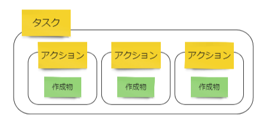

# Framework

## 1. Project Sprint は何を可能にするか

Project Sprint は、定例会議を活用して行動を習慣化することでプロジェクトを推進するフレームワークである。

変化の激しい環境の中で複雑なプロジェクトを推進し、よりよい成果をもたらすには、多様なメンバーが自律的に活動できなくてはならない。そのためには、個々のメンバーの活動を可能な限り疎結合にし、各自が行動を自己決定できるようにする必要がある。

定例会議を活用することで、各メンバーの行動の前提となるチームとしての共通了解を形成しつづけることができる。また、定例会議によって生み出されるリズムは、プロジェクトを推進したり見直したりするチームの行動を習慣化することができる。

## 2. Project Sprint が理想とする状態

プロジェクトの推進は、個々のチームメンバーがプロジェクトの目的にかなうと信じる作成物を出力しつづけることから生まれる。そのため Project Sprint では、「チームメンバーの自律的な活動により、プロジェクトの目的達成を目指した作成物が出力されつづけている状態」を、プロジェクトチームの理想的な状態と定義する。

環境の変化に合わせてプロジェクトを変化させながら、目的に沿った作成物を生み出しつづけるために、Project Sprint のフレームワークは構築されている。

## 3. プロジェクト推進の構造

### 3.1 出力と対話の反復

プロジェクトは、出力と対話の反復によって推進される。出力とは、各メンバーが自律的に活動して作成物を生み出すことである。対話とは、チームで集まって状況を把握し、各々が次の出力に向かえるようにすることである。

* **出力：各メンバーの活動** :&#x20;
  1. 各メンバーが、納得をもって自律的に行動を起こす
  2. 身体的な行動で具体的な作成物を出力し、その過程で多様な気づきを得る
  3. 作成物自体やその出力に伴って得られた気づきを材料に、次の対話に向けて準備をする

* **対話：チームでの活動** :&#x20;
  1. 各メンバーが、タスクの実践を通して出力された作成物と得られた気づきをチームに共有する
  2. チームとして環境を固定して現状認識を共有した上で、アイデアの共同創造や問題の共同解決を行い、プロジェクトの方向性に対する共通了解を形成する
  3. チームの共通了解を前提として、各メンバーが次の対話までにどう行動すべきかを自覚し納得できるようにする

この出力と対話の反復をスムーズにするために、3つの仕組みがある。

### 3.2 仕組み① 定例会議でパターンとリズムをつくる

Project Sprint の軸となるのは、上で述べた対話をプロジェクトのタイムラインに定期的に出現させること、つまり**定例会議**を設定することである。短い一定のタイムスパンで、同一のプロセスでの処理を繰り返すことで、各メンバーが自律的に行動できる環境と習慣をつくりだせる。

定例会議は、以下の3つの条件を満たしている必要がある。

* 短期的: プロジェクト全体のスケジュール感から見て相対的に短期であること
* 定期的: 人間の既存の習慣に沿った一定の期間が置かれること（日次、週次、隔週等）
* 反復的: 一定の型が存在すること（進行方法、アジェンダの種類や形式等）

定例会議を置き、決められたタイムスパンの中で反復的に行動することで、プロジェクトに一定のリズムが生まれる。そのことには、以下のようなメリットがある。

* 生産性が向上する（作成物生成の期日が明確化される）
* 計画しやすくなる（過去の実績を判断材料にすることで、タスクの粒度を揃えたり作業計画を立てたりしやすくなる）
* 分析して改善しやすくなる（行動が習慣化される）

Project Sprint における定例会議の仕組みは、各メンバーの習慣的行動を導くものであり、各メンバーに習慣的行動が根付くことにより、チームや組織に変革がもたらされる。習慣化された行動により作成物が定期的・反復的に生み出されつづけ、それがプロジェクトを推進したり見直したりする材料となる。

また、会議の進行方法やアジェンダの型を決め、それに沿って定期的に対話することにより、以下のようなメリットが生まれる。

* チームが納得した意思決定をしやすくなる（全員の環境を一時的に固定して認識を揃える）
* プロジェクトを観測しやすくなる（定点観測で状況を理解しやすくなる）
* 分析して改善しやすくなる（反復するたびに効率が良くなる）

### 3.3 仕組み② プロジェクトストーリーとロールの共通了解をつくる

プロジェクトにおける**共通了解**とは、対話や議論を通してチーム内で形成され共有されている認識のことを指す。ものごとの認識の仕方はメンバーごとに異なり、まったく同じ認識を共有できるわけではないという大前提に立ちながらも、各メンバーがプロジェクトをどのように認識しているかを定期的に確認し、チームとして目指すところを常に調整しつづけることで、統合的な行動が取れるようになる。

出力と対話のサイクルが回っていたとしても、チーム内で環境[^1]の認識にずれが生じていれば、各メンバーの行動はそのプロジェクトに相応しくないものになってしまう可能性がある。そうならないように、以下のような事柄については共通了解を形成しておく必要がある。

* プロジェクトストーリー（プロジェクトチームが何を目指しているかの認識を揃えることで、統合的な行動が取れる）
* チームメンバーの役割・期待（チームの中で自分が何をすべきかを納得することで、自信を持って行動できる）

これらをチームの納得に基づいて設定し共有しておくことは、共通の目的に向かってチームが自律的に行動しつづけるために非常に重要である。

### 3.4 仕組み③ 多様な観点から見直しを行う

チームメンバー全員の目線を使って、プロジェクトをよりよい状態にするべく定期的・継続的に改善しつづけるための仕組みとして、**継続的改善アプローチ**を用いる。

定例会議と活動のサイクルが回ることでプロジェクトは常に調整されているが、必ずしもすべての改善点が洗い出されているわけではない。また、これまでに述べた2つの仕組み自体を改善していく必要もある。フェーズの開始・終了時や大きな変更があったときなどプロジェクトの成果で区切って改善を行うだけでなく、月次・週次等定期的に見直しを行うことが重要である。

継続的改善アプローチの代表的なアクションとしては「定期的に過去の振り返りを実施してアイデアや問題をチームのものとして顕在化し、プロジェクトをよりよい状態にするための改善策を検討する」ということになるが、「過去」だけではなく「現在」にも目を向けることが重要だ。各メンバーが今現在感じている違和感や閃きを、リアルタイムでアイデアや問題に昇華して共有することが、チームの状況を改善するために不可欠だからである。

「過去」を見る振り返りだけを実施する場合、問題が共有されるのはその問題が起こってしまった後である可能性が高いが、「現在」を見ることで、問題が顕在化もしくは拡大する前に共有し対処することができるようになる。また、もやもやを解消できる場があることで、メンバーのプロジェクトへの参加意欲の向上にも繋がる。そのため Project Sprintでは、定例会議の中での違和感や閃きの共有という形で、定期的に現在の心境を出し合うことを推奨している。

### 3.5 すべては作成物の出力から始まる

この出力と対話の反復において重要なのは、**チームメンバーがタスクを実践して作成物を出力する**ことである。プロジェクトの前進につながる作成物が出力されること自体も重要ではある。しかし、より重要なのは、各メンバーがタスクの実践という具体的な行動を通して、プロジェクトや環境の情報、多様な視点からのひらめきや違和感を得て、それらをチームに共有することである。

作成物は、個人として実践した各メンバーの活動を、チームとして遂行するプロジェクトに統合する際の媒介となる。言語だけの対話では認識が揃いにくい場合も、具体的に目に見える作成物が対話の場に持ち込まれることで問題意識や課題が共有され、共通了解が形成されやすくなる。出力と対話のサイクルで、個人の活動の結果が他のメンバーの認識を小さく変容させることを繰り返して、プロジェクトチームとしての共通了解が揃ってゆく。

対話は、個人の活動の範囲内では個人のものでしかなかった作成物を、チームに共有することでチームのものにするプロセスでもある。個人の出力による作成物は、チームのもの、ひいてはプロジェクトのものになることによって成果や価値につながっていく。

また、対話は、出力に事後的な意味付けを行うという意味でも重要である。各メンバーが自身の行動の意味を前もって正確に理解したり、自己完結的に振り返って評価したりすることは難しい。出力の後にチームでの対話を行うことで初めて意味付けがなされ、自分の行動がプロジェクトの中で占める位置や重要性が認識できる。そのことによって得られる納得感が、さらに次の行動を自己決定する際の補助線になる。

### [WIP]3.6 タスクとアクション

Project Sprint においては、タスクとアクションを以下のように定義する。

タスク：何らかの活動の推進や改善のためにやるべき事項
アクション：タスクを実現するための、作成物の生成を伴う身体的な行動

### [WIP]3.7 todo と try

## 4. 価値と成果の構造

### 4.1 価値

価値とは、プロジェクト外部のステークホルダーが、プロジェクトが実行された結果として、意味や有用性を認識して受け取る便益である。

Project Sprint では基本的に、実現を目指す価値もそのために達成すべき成果も固定的なものではなく、設定時の環境を前提とした可変的なものであると捉える。環境の変化を捉えつづけながら最終的な成果に向けてプロジェクトを推進していくため、プロジェクトチームは小さな実験で小さく成果を積み重ね、仮説を検証しながら軌道修正を繰り返す。

また、プロジェクトチームは当然、ステークホルダーに価値を提供することを目指してプロジェクトを推進するが、プロジェクトからもたらされる便益に意味や有用性があるかどうかはあくまでステークホルダーの評価に委ねられるので、プロジェクトチームが意図し提供する便益と、ステークホルダーの認識する価値にずれが生じることもある。

この２つの理由から、Project Sprint においてはプロジェクトチームがプロジェクトにおける各時点で認識する価値はあくまで仮説であり、真に価値と言えるかどうかはステークホルダーを含む対話を通してのみ検証可能であることを念頭に置いておく必要がある。

なお、変化を前提とせず、当初設定した最終ゴールにまったく変更の余地がないという完全にウォーターフォール型のプロジェクトにおいては、プロジェクトチームが価値に関してステークホルダーと共通認識を持つことができる。そのため、この場合においてはプロジェクトチームが認識する価値は真の価値と同一のものといえる。

各メンバーの出力という個人単位の実験については真の価値に関する検証を含む必要はないが、プロジェクト単位では最終的に真の価値を提供できたかどうかの検証が必ずなされる必要がある。プロジェクト遂行中に部分納品を複数回行うようなアジャイル型のプロジェクトにおいては、デリバリーごとにステークホルダーからのフィードバックを得ることで、真の価値に関する検証を段階的に行っているといえる。

### 4.2 成果

成果とは、プロジェクト内のチームが、プロジェクト外部のステークホルダーに提供したい価値を踏まえ、プロジェクト内部のステークホルダー（当該成果の達成を担うチーム以外の別チーム）やプロジェクト全体に向けて生み出す所産である。

プロジェクトチームは、価値仮説を踏まえて最終的に達成したい成果をいくつかのフラッグに分解し、それぞれのフラッグの達成に取り組む期間を個々のフェーズとして出力に取り組む。価値仮説に対して予測した成果が正しければ、プロジェクトに**進捗**がもたらされる。逆に、実験と検証の結果、価値仮説と成果の関係性が予測通りでなかったことが判明した場合には、その結果をもとに以降の成果に対する仮説を組み立てなおすことで、プロジェクトに**変容**がもたらされる。

この際の目標到達点としてのフラッグは、以下のようなものとなる。

* 外部に依存せず、そのフラッグの達成に責任を持つチーム内で自己完結して行動できるものでなくてはならない
* そのフラッグを達成することが、フラッグの達成に責任を持つチームのみならず、プロジェクト内の他チームやプロジェクト全体に資する（＝成果となる）ものでなくてはならない（後述する成果物やあるべき状態は、当該成果の達成を担うチームを主語として設定されるが、成果は当該成果の達成を担うチームのみに便益を与えるものであってはならない）
* 環境の変化の影響を受けにくいように、開始から達成までの期間は長くとも2か月以内とする
* 直近の2か月程度を完了日とするものは必ず達成するとチームが外部に宣言するコミットメントでなくてはならないが、それ以降を期日とするものは仮説であってよい

フラッグの達成のために設定されるゴールは、プロジェクトやプロジェクト内の一定のフェーズの完了の定義となる。ゴールには、完了日の他に、次の2つの要素が含まれる。

* **あるべき状態** :　その状態に至ることで成果を達成したと判断できる、状態や定性的な捉え方。
  * 誰が何をできる状態なのか
  * ステークホルダーがどんな状態なのか
  * プロジェクトがどんな状態なのか
* **成果物** :　出力・作成されることで成果を達成したと判断できる、有形的なものや定量的な値。
  * 機能が付与されたサービス
  * ボリューム・内容イメージの資料
  * 目標として設定した測定値

ゴールをこの2つの要素両方を用いて表現することで、要素が相互に補完し合いチームの共通了解が形成されやすくなる。この2要素は共通かつ一定の価値仮説と成果を前提に設定され、プロジェクトが推進され完了日が近づいてくるにつれ、段階的に内容が更新されて精度が高まっていく。

フラッグの各要素もまた、相互に影響を与え合いながら精度を増していく。成果物やあるべき状態が段階的に精度を高めていくのに伴い、成果や価値仮説も変容することがある。また、成果や価値仮説が何らかの原因で変容したことにより、成果物やあるべき状態が変容することもある。

### 4.3 出力

出力とは、チームメンバーが作成物を産出することである。

成果と出力の関係は、次のようなものである。

1. プロジェクトチームは、外部に提供したい価値を踏まえ、実現すべき成果の仮説を立てる。
2. プロジェクトチームは、1で立てた仮説に従って、直近のフラッグを目指して出力に取り組む。
3. それぞれのチームメンバーは、目標を達成するための行動を自律的に設定し遂行する。
4. チームメンバーによる出力は小さな実験として、次の二つのインパクトを持ちうる。
   * 出力に取り組むことで得られた成果が、最終的な成果の実現に貢献する
   * 出力に取り組むことで得られた環境情報が、成果の仮説を更新する材料になる
5. プロジェクトチームは、上のインパクトに従って成果の仮説を更新し、目標やタスクの設定を最適化する。

この関係に則ってプロジェクトに取り組むことにより、プロジェクトチームは変化する環境と目的を捉えつづけながら、最新の仮説に従った成果を生み出すべく行動を最適化することができる。

## 5. チームの自律性の構造

Project Sprint における理想的なチームとは、プロジェクト内外の変化を素早く捉えつづけることのできる自律的なチームである。Project Sprint では、ある事柄に対して自分がチームのために何をすべきかを各メンバーが判断でき、かつ実際に行動できる状態のことを、自律的な状態であると定義する。

### シェアド・リーダーシップ

Project Sprint では、プロジェクト内外の変化を素早く捉えつづける自律的なチームであるために必要なものとして、シェアド・リーダーシップ[^2]の考え方を取り入れている。

シェアド・リーダーシップとは、プロジェクトがある特定のリーダーの指揮のもとで進むのではなく、メンバー全員がそれぞれ必要なときに必要なリーダーシップを発揮する状態のことを指す。

シェアド・リーダーシップの状態であるためには、**分化**と**統合**が同時に達成されている必要がある。つまり、各メンバーは自らの納得と決定に基づいて自律的・自発的に行動しながら（分化）、チームとしては同じ目標に向かって協調・連携している（統合）状態といえる。目標の共有によりチームとしての方向性が定まり、それを前提に各メンバーが行動を自己決定できるようになる。

分化的な行動のためには、各メンバーがチームの中での自身の責任や役割を自覚して納得したうえで相互に期待する内容を共有し、自信を持って行動できなくてはならない。

統合的な行動のためには、メンバーそれぞれがもつプロジェクトに対する認識を定期的に擦り合わせ、チームとして何を目指しているのかを調整しつづけて、協調・連携しながら行動できなくてはならない。

この分化と統合という一見相反することがらを同時に達成するためには、メンバー間の信頼関係を築くことが重要である。信頼関係が構築されると、

* 失敗を恐れず前向きに行動を自己決定できる　→　分化の促進
* 協力をリスクと捉えず助け合うようになる　→　統合の促進

### 活動がチーミングに与える効果

信頼の構築に最も効果的なのは活動と対話の繰り返し、特に具体的な作成物を生み出してそれをもとに対話を行うことである。個々人の活動の結果を踏まえて対話することで、各メンバーが納得できるかたちでチームとしての認識を揃えていくことができる。

活動、すなわち作成物への取り組みは、成果を実現したり仮説を変容させる材料を得たりする手段であるのと同様に、役割を引き受けてチームへの貢献と誠実さを示すことによって信頼関係を醸成する手段でもある。作成物そのものや作成物への取り組み方から、それを生み出したメンバーの経験やスキル、置かれている状況を見て取ることができる。他のメンバーの作成物を率直かつ公正に受けとめることもまた、相互の信頼の構築に大きく役立つ。

チームメンバー間の信頼関係がベースにあることで、相互の期待に対する共通了解が生まれ、各々が自分の活動を自己決定しやすくなる。各メンバーが自分の持ち場を自分で認識し、その場においてリーダーシップを発揮することで、「みんなでプロジェクトを進める」状態が実現される。

## 6. Project Sprint におけるプロジェクトの認識

Project Sprint においては、便宜上プロジェクトをプログレス、チーミング、プロセスという3つのドメインに分けて認識する。プロジェクトにおける個々の実践を、これらの3つの側面それぞれから解釈することで、個々の実践がプロジェクトの中で持つ意義や効果をより正確かつ多面的に認識できる。この認識をプロジェクトチームで共有することにより、個々のメンバーは実践に対する各自の具体的な行動を必要に応じて自律的に最適化することができるようになる。

この Framework における以下のセクションは、それぞれのドメインに対応したものである。
3. プロジェクト推進の構造　⇒　プロセス
4. 価値と成果の構造　⇒　プログレス
5. チームの自律性の構造　⇒　チーミング

以下の表は、それぞれの側面における認識のしかたを整理したものである。

|                                 | プログレス                                                                   | チーミング                                                                       | プロセス                                                                                                   |
| ------------------------------- | ----------------------------------------------------------------------- | --------------------------------------------------------------------------- | ------------------------------------------------------------------------------------------------------ |
| 何に焦点を当てるか                       | 成果                                                                      | チームメンバー相互の関係                                                                | 作成物の出力と定例会議のサイクル                                                                                                   |
| 何を目指すか                          | 成果の実現                                                                   | 自律的なチームの形成                                                            | プロジェクトを推進・改善しやすい環境の構築                                                                                  |
| 
どのような観点から プロジェクトを捉えるか
 | 最終的に目指す成果までのプロジェクトストーリーを描く　| 信頼関係を築き、分化的かつ統合的な自律的活動をチーム全員で行えるようにする | 作成物の出力と定例会議のサイクルで、自律的に行動できる環境・習慣をつくる |
| 重視される実践                         | 
成果の進捗・達成 成果の仮説の設定と更新
                                          | 
価値・成果の認識共有と納得 各自の責任・役割の自覚と引き受け
                                    | 
作成物の出力による一次情報の獲得 定例会議での問題の共同解決
                                                          |
| 重視される価値観                        | 
着実なタスクの実践による作成物の出力 環境の変化への<strong>能動的な追従</strong>
 | 
メンバー相互の<strong>信頼関係</strong>の構築 <strong>チーム全員でのプロジェクト推進</strong>
 | 
各メンバーが次の行動を<strong>自己決定</strong>する <strong>短期的・定期的・反復的</strong>な同期、<strong>継続的改善</strong>
 |

[^1]: ここで言う環境とは、プロジェクトやメンバーの状況はもちろん、プロジェクトの外部にある社会や組織など、プロジェクトやメンバーに影響を及ぼすすべての要素を含む。環境の変化がどのようにプロジェクトに影響を及ぼすかは、メンバーの感知・解釈によって決定される。

[^2]: 本セクションの記述に当たっては、以下の書籍を参照している。

    石川淳（2016）「シェアド・リーダーシップ：チーム全員の影響力が職場を強くする」中央経済社
