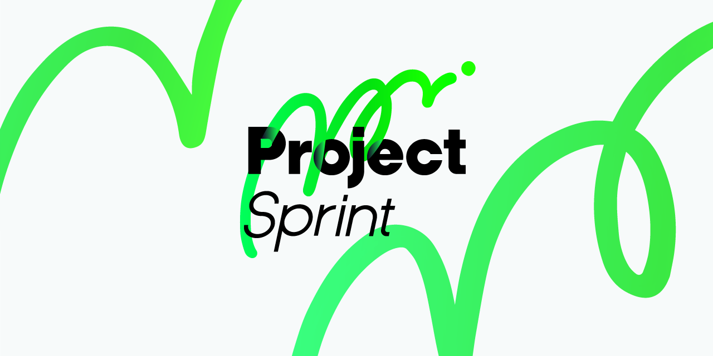

# Project Sprint

  

    【⚖️ <a href="project-sprint/v4/.3_ja/framework.md">Framework</a> | 🌏 <a href="project-sprint/v4/.3_ja/definitions.md">Definitions</a> | 🚀 <a href="project-sprint/v4/.3_ja/introduction.md">Introduction</a> | 👪 <a href="practical-guide/README.md">Practical Guide</a> | 📚 <a href="https://github.com/copilot-jp/project-sprint/releases">Release Note</a>】

## 📍 Project Sprint とは

Project Sprint は、定例会議を活用したプロジェクト推進のためのフレームワークです。本ドキュメントは、Project Sprint をオープンソースのメソッドとして公開しているものです。

Project Sprint 及び本ドキュメントは、2020年のリリース以降大小さまざまなアップデートを繰り返し、今現在も進化し続けています。

▼ 現在の最新ドキュメント

* [v4.3](project-sprint/v4/.3_ja/README.md)

## 🙆‍♂️ こんな方におすすめ

Project Sprint は、「チームがプロジェクトを規定する」という価値観に基づいて構築されています。もしあなたが、従来の価値観によるプロジェクトの固定的な枠組みの中で何らかの不自由さを感じているのなら、Project Sprint はあなたをそこから解放する手助けができるかもしれません。

* チームが主体として自由にプロジェクトを規定しつづけられるという価値観に共感する
* 従来の予測型のプロジェクトにおける管理的・中央集権的なアプローチがうまくいっていない
* 今までの自分のプロジェクトの進め方に迷いがあり、もっとよいやり方がないだろうかと悩んでいる

そんな方はぜひ一度、Project Sprint がご案内する適応型のプロジェクトの世界へ飛び込んでみませんか？

※Project Sprint におけるプロジェクトの捉え方について、さらに詳しくは[こちら](project-sprint/v4/.3/definitions.md)をご覧ください。

## ⚡️ はじめての方へ

本ドキュメントは、個々のプロジェクトチームの自律性や創造性の発揮を支援するための本質的な概念や価値観に重点を置きたいとの思いで記述されています。v4の公開に当たって、フレームワークとしての強度を高めることと文書管理をしやすくすることを目的として、v3までは本ドキュメントに含まれていた各概念の詳細な説明や実践の際の指針を、本ドキュメントから分離しました。

Frameworkの記述内容は抽象度が高く、厳密さを重視しているので、はじめての方にとっては少しとっつきにくいと感じられることもあるかと思います。理解を助けるため、必要に応じて過去バージョンを参照し、実践する際の具体的な行動をイメージしながらお読みいただければと思います。

1. Project Sprint からの提案の概要や、その基盤となる価値観を把握する\
   ☞ [Introduction](project-sprint/v4/.3_ja/introduction.md)
2. Project Sprint におけるプロジェクト観と用語の定義を理解する\
   ☞ [Definitions](project-sprint/v4/.3_ja/definitions.md)
3. Project Sprint の核となる概念や価値観に触れる\
   ☞ [Framework](project-sprint/v4/.3_ja/framework.md)
4. Frameworkを再読し、内容をより深く理解する\
   ☞ [Framework](project-sprint/v4/.3_ja/framework.md)　(再読)

## 🤗 フィードバックを歓迎します！

Project Sprint は、プロジェクトの現場で得られた実践知のフィードバックを受けることにより、アップデートを繰り返してきました。

* 不確実で変化の多いプロジェクトが増える中、プロジェクトに関わる人の苦悩を少しでも減らしたい
* プロジェクトに関わるすべての人が、プロジェクトで自分の能力を最大限活かせるようしたい

メンテナーはそんな思いで、今現在もProject Sprint を進化させるべく、試行錯誤を繰り返しています。

プロジェクトに関わる方それぞれがご自身の実践知をフィードバックしてくださることで、Project Sprint はより使いやすく、多くの人にとって価値のあるものになってゆくでしょう。

どのようなかたちや内容であれ、このメソッドに関心やご意見、共感をお寄せいただけることを嬉しく思います。また、Project Sprintの発展に貢献したいと考えてくださる方も歓迎します。

**＜フィードバックの方法＞**

GitHub上で、このリポジトリに関するあらゆることを自由に議論したり相談したりすることができます。

<B>1. Pull Request</B>

Project Sprint上の記述に関して具体的な修正内容を提案したい場合は、Pull Request をご利用ください。 GitHub の画面右上にある Fork ボタンをクリックすると、ご利用の GitHub アカウントに紐付いた本リポジトリのコピーが作成されます。このコピーのことをフォークと呼びます。フォークリポジトリの中ではお好きなように変更を加えていただいて構いません。加えた変更をこのリポジトリに追加したい任意のタイミングで、フォークリポジトリから Pull Request を作成してください。なお、既に本リポジトリをフォークされている場合は、修正提案用のブランチを任意の名前で作成した上で、 Pull Request を作成してください。

Pull Request が作成されると、コントリビューターの中のレビュー担当者が責任を持って明確かつ実用的なフィードバックを返します。 Pull Request の作成者が、ご自身の役目としてフィードバックに対応してください。 また、状況によっては2人以上のレビュー担当者からフィードバックが返されたり、アサインされていないレビュー担当者からのフィードバックが来ることがある点もご注意ください。

<B>2. Issues</B>

具体的な修正内容にまで落とし込めていないものの、Project Sprint に反映されるべきだと思われる課題やご意見をお持ちの方は、 Issue をご利用ください。Project Sprintの文面やウェブサイトそのもの（デザインやリンク構造など）に違和感を覚えたり修正が必要だと考えた場合も Issue を作成していただいて構いません。Issue 一覧右上にある New Issue ボタンから新しい Issue を作成し、タイトルと本文を記載します。Assignees、Labels、Projects、Milestone といった項目は、メンテナーや Issue の対応担当者によって設定されるため、記入の必要はありません。

Issue が作成されると、コントリビューターの中のレビュー担当者がIssueのファシリテーションやトリアージを行い、必要に応じて Issue の作成者と議論しながら議題を明確化します。Project Sprint へ反映させるべき内容である場合には、対応を適切なコントリビューターにアサインします。

<B>3. Discussions</B>

[Discussions](https://github.com/copilot-jp/project-sprint/discussions)　は気軽で自由なコミュニケーションの場です。Project Sprint に関して議論したい内容や質問、ご意見がおありの際には、Discussions をご利用ください。Project Sprintの記述に関することやデザイン・リンク構造等が主なトピックになりますが、こうした内容に限らず自由にDiscussionを作成することができます。漠然とした意見や感想から会話が広がり、議論や課題認識が生まれることも多くありますので、些細なことでもぜひ投稿してみてください。

主に次の３つのカテゴリーが活用されています。

- Development：近い将来に Issue として Project Sprint の記述に盛り込んでいきたいトピックに関する議論が行われます。
- Ideas：Project Sprint をよりよくするための様々なアイデア、共感や違和感などの気づきが投稿されます。
- Q&A：Project Sprint に関する素朴な疑問や質問が投稿されます。

それぞれの Discussion において十分な議論や情報の整理が行われ、Issue として Project Sprint への記述に取り掛かれる状態になったら、対応する Issue が起票されます。Issue の起票は誰が行っても構いませんが、不明点や不安がある場合にはメンテナーがサポートします。その後の Issue のファシリテーション・トリアージとリリース管理もメンテナーが担います。
