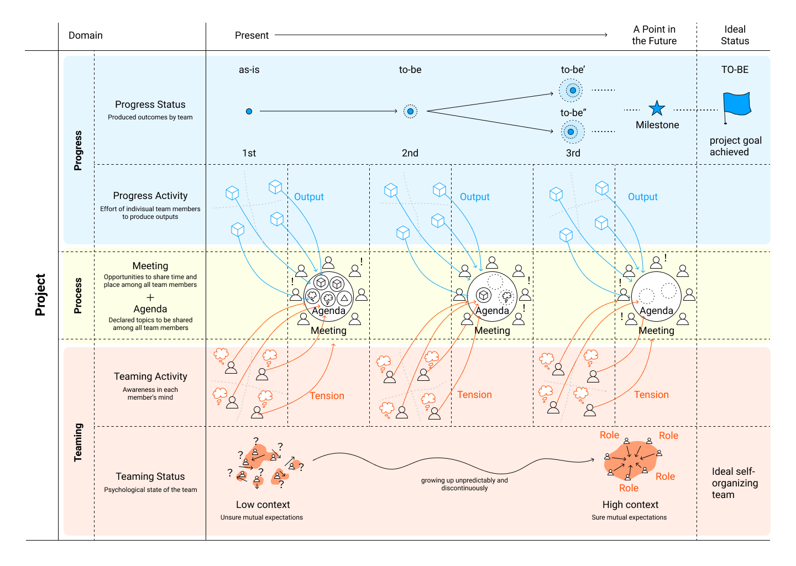

Project Sprint Essentials
This document is defining the core concept and framework of Project Sprint, to give the essential understanding of it.

## Principle
In the framework of Project Sprint, what is happening in the project is classified into 3 types as follows.

1. **Progress Activity** by each member, to make the incremental deliverables.
2. **Teaming Activity** by each member, to build up the self-organizing team.
3. **Process**, the system enabling all members to sync up, resulting in more and more practice and optimization.

By going and back these two activities and Process iteratively and regularly, the team can achieve below TO-BE Status simultaneously.

* Status of the project goal achieved
* Status of the ideal self-organizing team built up

## Activity
There are 2 types of activities by each member in the project.

**Progress Activity** is for individual member to complete assigned ToDos and generate **Output** for incremental deliverables.

**Teaming Activity** is for individual member to come up with anything about the team or the project itself, resulting in **Tension** which should be shared with the team.

## Process

Process is the unique system of Project Sprint, which enables activities by individual member to contribute to the Status of project overall in the most efficient and effective ways.

Process has Meeting and Agenda as its component.

**Meeting** : the opportunity to share the time and place together among all team members.

**Agenda** : the declared topic come from each member's output or tension, to be shared among all team together.

Agenda works as the focus point, which enables team member concentration on the output or tension one by one.

Meeting is the place where individual team member show their personal opinion and feelings explicitly or implicitly, so that they can sync up with each other.

As a result of Process, we can achieve;

  * Task of practice and optimization for the Status of the project goal achieved
  * Task of practice and optimization for the Status of ideal and self-organizing team
  * Task of practice and optimization for Process itself

## Status

By going and back these two activities and Process iteratively and regularly, the team can achieve below TO-BE Status.

* Status of the project goal achieved
* Status of the ideal self-organizing team built up

The team can reach out **Status of the project goal achieved** by making incremental deliverables, from the as-is point to the TO-BE point defined by the project goal. The specific points in the future are called as **Milestone**. This clarification helps the team to reconsider if they are on the right track towards project goal.

The team can reach out **Status of the ideal self-organizing team built up**, by growing up unpredictably and discontinuously, from the current condition to the ideal condition defined the team's values. The higher the context of the team become explicitly or implicitly, the surer the expectation with each other become.

## Role
The Project Sprint needs some roles for its installation and actual use.
For each role can be covered by more than one person.

#### Progress Management
The role to lead practice and optimization of Progress Activity for the Status of the project goal achieved.

#### Team Management
The role to practice and optimization of Teaming Activity for the Status of ideal and self-organizing team.

#### Process Admin
The role to lead practice and optimization of Process.

#### Sprint Master
The role to support installation of Project Sprint which is defined in this document.

##### Blueprint of Project Sprint

