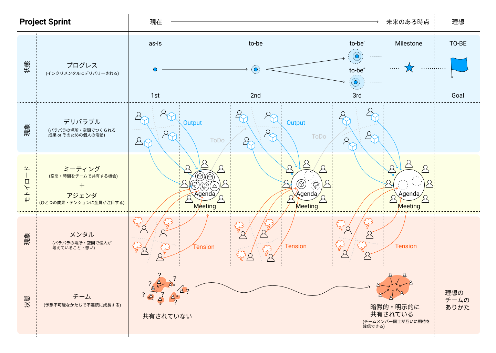

# プロジェクトスプリント エッセンシャルズ

このドキュメントは、プロジェクトスプリントのコアとなる概念とフレームワークについての定義を示し、理解を与えることを目的としている。

## プロジェクトスプリントの原理

プロジェクトスプリントでは、プロジェクトにおける現象を次の3つに分けて考える。
1. プロジェクトの進捗のための個々人の活動（**デリバラブル・アクティビティ**）
2. チームの形成のための個々人の活動（**メンタル・アクティビティ**）
3. それぞれの活動の実践と最適化を促進するために、全メンバーが同期する仕組み（**スーパーグッドプロセス**）

2つのアクティビティとスーパーグッドプロセスを定期的・反復的に繰り返すことで、

* プロジェクトのゴールが達成されている状態
* 自律的で理想的なチームが形成されている状態

を同時に実現する。

## アクティビティ
プロジェクトにおいて、個々人が行う活動は以下の二つに分けられる。

**デリバラブル・アクティビティ** とは、プロジェクトの進捗のため、個々人が自身に割り当てられた作業を完遂することで、成果につながる作業結果(**アウトプット**)が生まれる。

**メンタル・アクティビティ** とは、プロジェクトを過ごす中で、個々人それぞれがプロジェクトやチームに対して考えを持つようにったり、想起したりすることで、この中から、他のメンバーに伝えたい違和感(**テンション**)が生まれる。

## スーパーグッドプロセス

スーパーグッドプロセスは、個々人のアクティビティをプロジェクト全体の成果に反映させるためのプロジェクトスプリント特有の仕組みである。

スーパーグッドプロセスは、ミーティングとアジェンダという2つの構成要素を持つ。

**ミーティング** とは、チームメンバー全員が空間や時間を共有する機会のことである。

**アジェンダ**　とは、個々人のアクティビティの結果（アウトプットとテンション）が、チームメンバーと共有されるために明文化されたものである。アジェンダとなることで、ひとつの成果やテンションにチームメンバー全員が注目することが容易になる。

ミーティングの場でチームメンバーが全員でアジェンダを議論することで、個々人中にとどまっている情報を一斉に同期することができる。

最終的に、スーパーグッドプロセスは次の結果をもたらす。

  * プロジェクトのゴールを達成するための実践と最適化のタスク
  * 自律的で理想的なチームを形成するための実践と最適化のタスク
  * スーパーグッドプロセス自体の実践と最適化のためのタスク

## 状態
2つのアクティビティとスーパーグッドプロセスを定期的・反復的に繰り返すことによって、プロジェクトのゴールの達成と自律的で理想的なチームの形成に近づく。

**プロジェクトのゴールの達成** に近づくとは、現在いる地点から理想とするプロジェクトの最終到達地点に向かって漸進的に成果物を積み重ねていくことである。未来における特定の地点をマイルストーンと呼び明示化することで、最終到達地点に向かう道筋の確からしさを確認することができるようになる。

**自律的で理想的なチームの形成** に近づくとは、現在のあるチームの状況から理想とするチームのあり方に向かって予測不可能・不連続ながらも成長していくことである。チームメンバー間のコンテクストが明示的・暗黙的に共有されていくことで、お互いに対する期待に確信を持つことができるようなる。

## ロール
プロジェクトスプリントの導入と実践には次のようなロールが必要とされる。それぞれのロールは複数人によって担うことも可能である。

#### プログレスマネジメント
デリバラブル・アクティビティの実践と最適化、およびこれによってもたらされるプロジェクトのゴールの達成をリードする。

#### チームマネジメント
メンタル・アクティビティの実践と最適化、およびこれによってもたらされる自律的で理想的なチームの形成をリードする。

#### プロセスアドミン
スーパーグッドプロセスの実践と最適化をリードする。

#### スプリントマスター
本エッセンシャルズで定義されるプロジェクトスプリントのフレームワークの導入をサポートする。

## プロジェクトスプリント概念図

