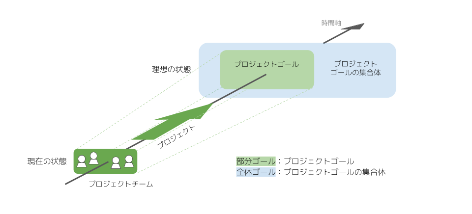

# Project Sprint 101

プロジェクトスプリントは、プロジェクトチームがプロジェクトゴールを設定したりプロジェクトゴールに向かって進んだりするのを助けるために、ものごとの捉え方・考え方や、最適化を促進するための仕組みを提供します。

ここでは、プロジェクトスプリントの概要を説明し、「準備しよう」「やってみよう」「改善しよう」における個別のドキュメントの内容を理解しやすくします。

### プロジェクトとプロジェクトゴール

プロジェクトスプリントでは、解決したい大きな課題に取り組む過程のうち、現状のプロジェクトチームで推進・達成に現実味が持てる一部分を切り出したものを、**プロジェクト**と定義します。つまり、プロジェクトは「全体」に対する「部分」であり、プロジェクトゴールは「全体ゴール」の達成に近づくために必要な一歩としての「部分ゴール」ということになります。全体ゴールは、プロジェクトゴールの集合体です。

プロジェクトに不可欠な要素は、**プロジェクトチーム**とそのプロジェクトチームによって設定された**プロジェクトゴール**の二つです。プロジェクトチームとは、後述するように、プロジェクトゴールに対する共通認識をもち、その達成に向けて相互に協力し合うメンバーの集まりです。プロジェクトゴールとは、プロジェクトチームによって定められた一定の状態や作成物です。通常複数の中間的な状態・作成物を経て、最終的な状態・作成物としてのプロジェクトゴールが達成されます。

プロジェクトゴールは、**プログレスゴール**と**チーミングゴール**から成ります。プログレスゴールとはプロジェクトの成果として目指すべき状態が達成されたり作成物が出力されたりすることであり、チーミングゴールとは理想的なプロジェクトチームが形成されることです。  
どちらに比重が置かれるかはプロジェクトによって異なりますが、プロジェクトが成功しより大きな価値を生み出すためには、プロジェクトの進め方や進み具合だけでなくプロジェクトチームのあり方についても考える必要があるため、双方のゴールが常に意識されることになります。

### プロジェクトチーム

プロジェクトスプリントでは、以下がプロジェクトチームの定義であり必要な構成要素であると考えています。

1. 共通のプロジェクトゴールを目指していること
2. メンバー間で相互に協力し合うこと
3. プロジェクトやプロジェクトゴールそのものを再定義できること（もしくは、再定義するための仕組みがあること）

プロジェクトチームは、プロジェクトゴールを達成するために小さな実験を繰り返し行います。はじめから固定的なゴールに対する完璧な答えを生み出そうとするよりも、プロジェクトを一定の期間で区切って定例ミーティングを置き、進捗や全体像を見直して軌道修正を繰り返しながら少しずつ歩みを進め、必要に応じてゴールを再定義することで、ゴールに至る道のりがより適切なものになります。この「漸進的にものごとを進める」という考え方が、プロジェクトスプリントでは非常に重要です。

プロジェクトチームの機能としては、プロジェクトゴールの設定や変更とそこに至るまでの共通認識や納得感の形成を行うことや、メンバー間で各々の期待値を共有・納得した上で役割分担や作業の進め方を調整することが挙げられます。チームとしてよりよい形でプロジェクトゴールに向かっていくために、個々人の活動の前提を与えたり考えたりするのがプロジェクトチームであるといえます。

### プロジェクトスプリントの基本メカニズム

プロジェクトスプリントの基本のメカニズムは、「個人単位で作成物の出力に取り組んだ成果を、プロジェクトチームとして定期的・反復的に持ち寄って擦り合わせ、プロジェクトを現在の状態から理想の状態に漸進的に近づけていくことによって、プロジェクトゴールを達成する」というものです。

メンバー間で共有されたプロジェクトゴールに向かって、役割分担しながら目に見える作成物を小さく生み出しつづけることで、プログレスゴールの達成に漸進的に近づいていきます。また、作成物の出力に取り組む中で生まれた、他のメンバーに伝えたいアイデアや問題、違和感（**テンション**）を**ミーティング**で共有しプロジェクトチーム全体の認識を揃えることによって、アイデアを共同創造したり問題の共同解決を行ったりすることが可能になります。こうしてチーミングゴールへの達成へも近づくことができます。

推進プロセスは、ミーティングとそこでのアジェンダの議論を軸としています。最も重要なのは全メンバーが同期する定期的・反復的な定例ミーティングですが、それだけでなく、一部のメンバーで行われるミーティングや必要に応じてスポットで行われるミーティングも、推進プロセスの場として有効に機能します。

プロジェクトスプリントではミーティングを、「チームメンバーが一時的に同一の環境に固定されてリアルタイムで会話をすることにより、素早く効率的な認識合わせと、全員にとって納得感のある意思決定をする場」、またアジェンダを「個人から出力されたアイデア・問題・テンションを、他のメンバーと共有し次の行動を決定するために明文化したもの」と位置付けています。これらを通じて、作成物への取り組み状況の共有やプロジェクトゴールの見直し、互いの役割の調整をすることができます。

作成物の出力に取り組む中で発見された個々人のアイデア・問題・テンションは、ミーティングのアジェンダとしてインプットされ議論されます。その結果、次に個々人が取り組むべきものごとや方向性が明確になり、次の取り組みからさらに次回のミーティングでのアジェンダの材料となる個々人のアイデア・問題・テンションが生まれます。プロジェクトチームは、このサイクルを繰り返すことで継続的な改善を行いながら、プロジェクトゴールの達成に近づいていきます。  
この一連の流れにおいて、作成物の出力に取り組むことは非常に重要な意味を持ちます。作成物に継続的に取り組めていなければ、課題や違和感に気づく機会が失われ、改善がストップしてしまいます。作成物に取り組むからこそ、問題をすぐに発見して適切なアジェンダを提案でき、ミーティングでの課題解決の質やプロジェクト全体の改善のスピードを上げることができるのです。

### プロジェクトの「理想の状態」

では、プロジェクトの「理想の状態」とはいったいどういうものなのでしょうか？

まず、個人のレベルにおいては、以下が理想の状態と言えます。

* プロジェクトゴールに、個人として納得感と達成への現実味が持てている。
* チームにおける自分の責任・役割・期待値に納得感が持てており、自分がチームのために何をすべきかを自律的に判断し実際に行動できている。
* 作成物が継続的に出力され、その結果としてミーティングのアジェンダとすべき問題点やテンションが生まれている。
* 複数の作成物に同時進行で取り組む場合、それぞれの作成物に対する活動が疎結合となっており、自律的に遂行できる。

また、プロジェクトチームとしては、以下が理想の状態です。

* プロジェクトチームの納得を得たプロジェクトゴールが設定され、環境の変化に応じて都度見直されており、メンバー間でプロジェクトゴールに対する共通認識が持てている。
* プロジェクトゴールがプロジェクト外の大きなゴールを目指しているメンバーに対しても明確に示されており、大きなゴールに対してのプロジェクトの役割や位置づけが明確になっている。
* プロジェクトゴール達成に向けた各自の責任・役割・期待値が共有されており、各メンバー相互の認識に齟齬がない。
* 役割やスキルを問わず個々人が相互に尊重され信頼されていると感じられ、誰もがテンションを上げやすい環境になっている。

加えて、先述した推進プロセスがスムーズに機能していることが、プロジェクトの理想の状態と言えるでしょう。
