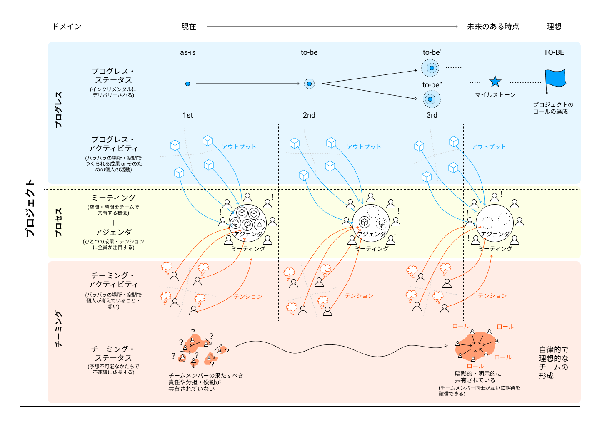

# プロジェクトスプリント エッセンシャルズ

このドキュメントは、プロジェクトスプリントのコアとなる概念とフレームワークについての定義を示し、理解を与えることを目的としている。

## プロジェクトスプリントの原理

プロジェクトスプリントでは、プロジェクトにおける現象を次の3つの **ドメイン** に分けて考える。

1. **プログレス** : プロジェクトの進捗のための個々人の活動（**プログレス・アクティビティ**）および、プロジェクトで定められたゴールを達成しているかどうかを示す進捗状態 (**プログレス・ステータス**)
2. **チーミング** : チームの形成のための個々人の活動（**チーミング・アクティビティ**）および、自律的で理想的なチームが形成されているかどうかを示す状態（**チーミング・ステータス**)
3. **プロセス** : それぞれの活動の実践と最適化を促進するために、全メンバーが同期する仕組み。

プログレスとチーミングのアクティビティとプロセスを定期的・反復的に繰り返すことで、プログレスとチーミングのステータスがあるべき姿に近づく。

## ステータス
プロジェクトは、プログレスとチーミングのステータスを理想的な状態に近づけることを目的としている。

プロジェクトチームは、プログレス・ステータスを **プロジェクトのゴールの達成** に近づけることを目的としている。これは、現在いる地点から理想とするプロジェクトの最終到達地点に向かって漸進的に成果物を積み重ねていくということである。未来における特定の地点をマイルストーンと呼び明示化することで、最終到達地点に向かう道筋の確からしさを確認することができるようになる。

プロジェクトチームは、チーミング・ステータスを、**自律的で理想的なチームの形成** に近づけることを目的としている。これは、現在のあるチームの状況から理想とするチームのあり方に向かって予測不可能・不連続ながらも成長していくということである。チームメンバー間のコンテクストが明示的・暗黙的に共有されていくことで、お互いに対する期待に確信を持つことができるようなる。

## アクティビティ
プロジェクトにおいて、個々人が行う活動は以下の二つに分けられる。

**プログレス・アクティビティ** とは、プロジェクトの進捗のため、個々人が自身に割り当てられた作業を完遂することで、成果につながる作業結果(**アウトプット**)が生まれる。

**チーミング・アクティビティ** とは、プロジェクトを過ごす中で、個々人それぞれがプロジェクトやチームに対して考えを持つようにったり、想起したりすることで、この中から、他のメンバーに伝えたい違和感(**テンション**)が生まれる。

## プロセス

プロセスは、個々人のアクティビティをプロジェクト全体の成果に反映させるためのプロジェクトスプリント特有の仕組みである。

アクティビティとプロセスを定期的・反復的に繰り返すことによって、ステータスが理想的なものになっていく。

プロセスは、ミーティングとアジェンダという2つの構成要素を持つ。

**ミーティング** とは、チームメンバー全員が空間や時間を共有する機会のことである。

**アジェンダ**　とは、個々人のアクティビティの結果（アウトプットとテンション）が、チームメンバーと共有されるために明文化されたものである。ある成果やテンションは、アジェンダとなってはじめて、チームメンバー全員から明示的に認識されることが可能になる。

ミーティングの場でチームメンバーが全員でアジェンダを議論することで、個々人中にとどまっている情報を一斉に同期することができる。

最終的に、プロセスは次の結果をもたらす。

  * プログレスドメインにおける、プロジェクトのゴールを達成するための実践と最適化のタスク
  * チーミングドメインにおける、自律的で理想的なチームを形成するための実践と最適化のタスク
  * プロセスドメインにおける、仕組み自体を改善するための実践と最適化のタスク

## ロール
プロジェクトスプリントにおいて個々人が担う役割のことを **ロール** と呼ぶ。それぞれのロールは、複数人によって担うことも可能である。なお、プロジェクトスプリントの導入と実践は各チームメンバー全員が率先して行うことが期待される。

##### プロジェクトスプリント概念図

