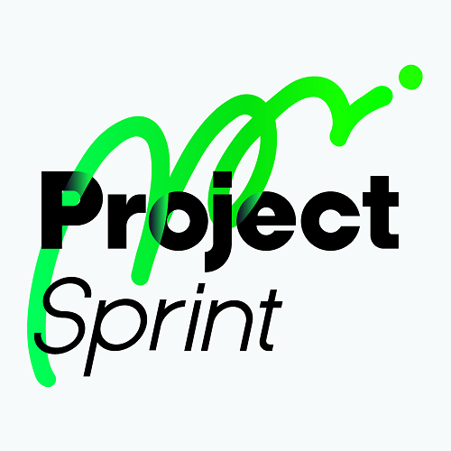

## Project Sprint

多様性のあるメンバーによる部門/組織横断のチームが、不確実性の高い環境・状況で、複雑なアウトプットを行うプロジェクトを推進するためのフレームワークとメソッド。

## Project Sprint Documents

プロジェクトスプリントのコアとなる概念とフレームワークについての定義を示し、理解を与えることを目的としたドキュメント。

* [プロジェクトスプリント エッセンシャルズ](essentials/index.md)

エッセンシャルズに記載されている内容のうち、プロセスについて、その詳細を記述し、さらに深い理解を与えることを目的としたドキュメント。

* [プロジェクトスプリント エッセンシャルズ ディテイルズ プロセス編](essentials/details.html)

プロジェクトスプリントをより完全なかたちで導入・運用するために必要となる概念とフレームワークについての定義を示し、理解を与えることを目的としたドキュメント。

* [プロジェクトスプリント アドバンス](advance/index.html)

プロジェクトスプリントの導入と運用にあたり有用である概念や用語を定義しているドキュメント。

* [プロジェクトスプリント プラグイン](plug-in/index.html)
