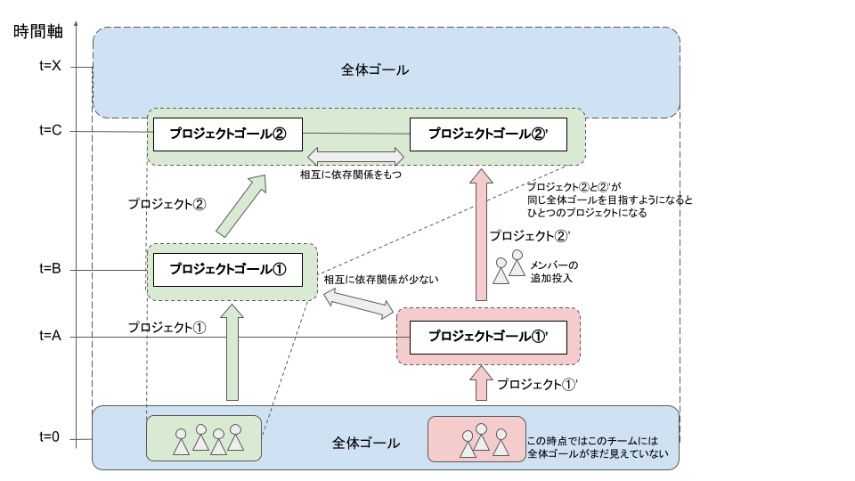
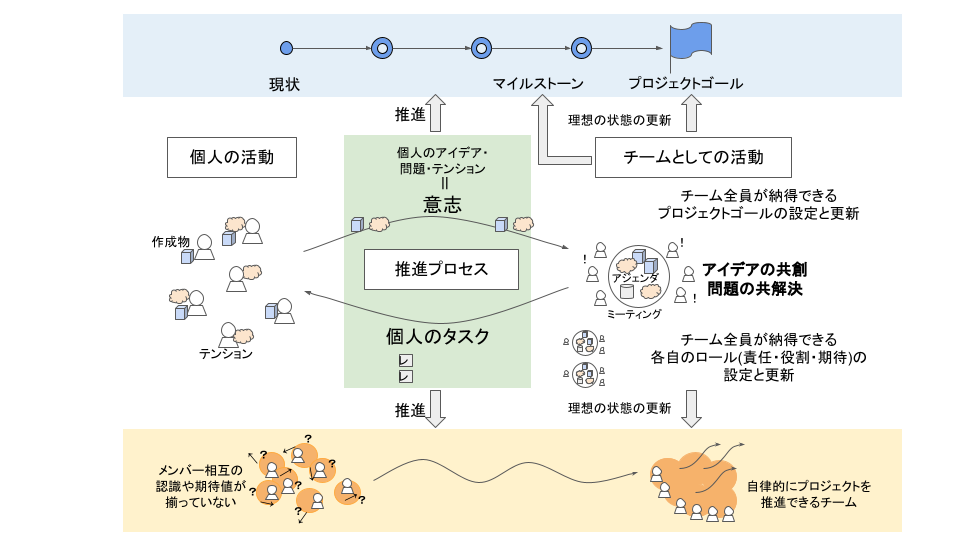

# Project Sprint 101

プロジェクトスプリントは、プロジェクトチームがプロジェクトゴールを設定したりプロジェクトゴールに向かって進んだりするのを助けるために、ものごとの捉え方・考え方や、最適化を促進するための仕組みを提供します。

ここでは、プロジェクトスプリントの概要を説明し、「準備しよう」「やってみよう」「改善しよう」における個別のドキュメントの内容を理解しやすくします。

### プロジェクトスプリントにおける「プロジェクト」

プロジェクトスプリントでは、解決したい大きな課題に取り組む過程のうち、現状のプロジェクトチームで推進・達成に現実味が持てる一部分を切り出したものを、**プロジェクト**と定義します。つまり、プロジェクトは「全体」に対する「部分」であり、プロジェクトゴールは「全体ゴール」の達成に近づくために必要な一歩としての「部分ゴール」ということになります。全体ゴールは、プロジェクトゴールの集合体です。

プロジェクトに不可欠な要素は、**プロジェクトチーム**とそのプロジェクトチームによって設定された**プロジェクトゴール**の二つです。プロジェクトチームとは、プロジェクトゴールに対する共通認識をもち、その達成に向けて相互に協力し合うメンバーの集まりです。プロジェクトゴールとは、プロジェクトチームによって定められた一定の状態や作成物です。通常複数の中間的な状態・作成物を経て、最終的な状態・作成物としてのプロジェクトゴールが達成されます。

### プロジェクトスプリントにおける「プロジェクトチーム」

プロジェクトスプリントの中心はプロジェクトチームであり、プロジェクトを定義するのもプロジェクトチームです。そのため、プロジェクトが成功し、より大きな価値を生み出すためには、プロジェクトの進め方だけでなくプロジェクトチームのあり方についても考える必要があります。

プロジェクトスプリントでは、以下がプロジェクトチームの定義であり必要な構成要素であると考えています。

1. 共通のプロジェクトゴールを目指していること
2. メンバー間で相互に協力し合うこと
3. プロジェクトやプロジェクトゴールそのものを再定義できること（もしくは、再定義するための仕組みがあること）

中でも、「プロジェクトやプロジェクトゴールそのものを再定義できること」がプロジェクトチームをプロジェクトチームたらしめる上で重要な要素です。\
はじめから固定的なゴールに対する完璧な答えを生み出そうとするよりも、いくつかに切り分けて軌道修正を繰り返しながら少しずつ歩みを進め、必要に応じてゴールを再定義することで、ゴールに至る道のりがより適切なものになります。この「漸進的にものごとを進める」という考え方が、プロジェクトスプリントでは非常に重要です。

### プロジェクトスプリントにおける2つの活動

プロジェクトスプリントでは、プロジェクトは2つの活動から成ると考えています。

#### 個人の活動

プロジェクトゴール達成のために行われる、各メンバー個人で完結する活動を指します。プロジェクトゴールの達成に向けた工程を、小さな作業（**タスク**）に分解して分担し効率よく遂行し続けることで、目に見える作成物が生み出されて、プロジェクトゴールに漸進的に近づいていきます。また、タスクを遂行する中で、他のメンバーに伝えたいアイデアや問題、違和感（**テンション**）が生まれます。

#### チームとしての活動

チームとしてよりよい形でプロジェクトゴールに向かっていくための、個人では完結しないチームとしての活動を指します。個々人の活動の前提を与えたり考えたりするのがチームです。個々人がタスクに取り組む中で生まれた作成物やアイデア・問題・テンションを**ミーティング**で共有し認識を揃えることによって、プロジェクトチームとしてのアイデアを共同創造し、問題の共同解決を行って次の行動を決定することが重要です。具体的には、プロジェクトゴールの設定や変更とそこに至るまでの共通認識や納得感の形成を行うことや、各メンバーの責任・役割・期待値を共有した上でタスクの分担や進め方を決めることが挙げられます。

### プロジェクトスプリントの基本メカニズム

プロジェクトスプリントの基本のメカニズムは、「個人の活動の結果を、チームとして定期的・反復的に持ち寄って擦り合わせ、プロジェクトを漸進的に理想の状態に近づけていくことによって、プロジェクトゴールを達成する」というものです。プロジェクトチームは、現在いる地点から理想とするプロジェクトゴールに向かって反復的かつ漸進的に進んでいきます。つまり、プロジェクトを一定の期間で区切って定例ミーティングを置き、進捗や全体像、取るべき道筋を見直しながら、段階的にプロジェクトゴールに近づいていくのです。

#### 推進プロセス

このメカニズムを効果的に実行できるよう、個人の活動とチームとしての活動の成果をやり取りし、双方の実行と最適化を促進するための仕組みを、「推進プロセス」と呼びます。\
推進プロセスは、ミーティングとそこでのアジェンダの議論を軸としています。最も重要なのは全メンバーが同期する定期的・反復的な定例ミーティングですが、それだけでなく、一部のメンバーで行われるミーティングや必要に応じてスポットで行われるミーティングも、推進プロセスの場として有効に機能します。\
プロジェクトスプリントではミーティングを、「チームメンバーが一時的に同一の環境に固定されてリアルタイムで会話をすることにより、素早く効率的な認識合わせと、全員にとって納得感のある意思決定をする場」、またアジェンダを「個人の活動から生まれた問題点やテンションを、他のメンバーと共有し次の行動を決定するために明文化したもの」と位置付けています。これらを通じて、タスクの進捗状況を共有したり、プロジェクトゴールの見直しや互いの役割の調整をすることができます。

タスクを遂行する中で発見された個々人のアイデア・問題・テンションは、ミーティングのアジェンダとしてインプットされ議論されます。その結果、次の個々人のタスクがアウトプットとして設定され、そのタスクが遂行されることでさらに次のミーティングでのアジェンダの材料となる個々人のアイデア・問題・テンションが生まれます。プロジェクトチームは、このサイクルを繰り返すことで継続的な改善を行いながら、プロジェクトゴールの達成に近づいていきます。\
このプロセスの根幹にあるのはタスクの実行ですから、プロジェクトにおいて、タスクを実行し完了させることは非常に重要な意味を持ちます。タスクが円滑に遂行されていなければ、課題や違和感に気づく機会が失われ、改善がストップしてしまいます。タスクに継続して取り組み続けているからこそ、問題をすぐに発見して適切なアジェンダを提案でき、ミーティングでの課題解決の質やプロジェクト全体の改善のスピードを上げることができるのです。

### プロジェクトの「理想の状態」

では、プロジェクトの「理想の状態」とはいったいどういうものなのでしょうか？

まず、個人の活動については、以下が理想の状態と言えます。

* プロジェクトゴールに、個人として納得感と達成への現実味が持てている。
* チームにおける自分の責任・役割・期待値に納得感が持てており、自分がチームのために何をすべきかを自律的に判断し実際に行動できている。
* タスクが円滑に遂行され、その結果としてミーティングのアジェンダとすべき問題点やテンションが生まれている。
* 複数の作成物に同時進行で取り組む場合、それぞれの作成物に対する活動が疎結合となっており、自律的に遂行できる。

また、チームとしての活動については、以下が理想の状態です。

* プロジェクトチームの納得を得たプロジェクトゴールが設定され、環境の変化に応じて都度見直されており、メンバー間でプロジェクトゴールに対する共通認識が持てている。
* プロジェクトゴールがプロジェクト外の大きなゴールを目指しているメンバーに対しても明確に示されており、大きなゴールに対してのプロジェクトの役割や位置づけが明確になっている。
* プロジェクトゴール達成に向けた各自の責任・役割・期待値が共有されており、各メンバー相互の認識に齟齬がない。
* 役割やスキルを問わず個々人が相互に尊重され信頼されていると感じられ、誰もがテンションを上げやすい環境になっている。

加えて、この2つの活動の間で推進プロセスがスムーズに機能していることが、プロジェクトの「理想の状態」と言えるでしょう。

### プロジェクトゴールの設定と変更

プロジェクトチームが目指すのはプロジェクトゴールを達成することですから、まずは将来達成したいプロジェクトゴールを定義しなくてはなりません。プロジェクトゴールを設定する際には、プロジェクトを取り巻く種々の前提や条件（**制約**）が織り込まれている必要があるのはもちろんですが、重要なのはプロジェクトチームの納得感を得たものであることです。メンバー間で合意され共通の認識があるプロジェクトゴールを設定することで、個々のメンバーがその達成に現実味と納得感を持ってプロジェクトに参画できるのです。

ただし、プロジェクトゴールは確定された不変のものではなく、むしろ環境の変化に応じて柔軟に書き換えられたり進化したりしうるものなので、常に見直してよく、また見直す必要があると言えます。プロジェクトゴールは、市場環境の悪化や組織の体制変更、稟議スケジュールの変更といったプロジェクトの外部環境の変化によって調整が必要になることもあれば、プロジェクトを進める中で得られた洞察やチームメンバーの共通認識・役割期待の遷移といった内部的な変化によって進化することもあります。プロジェクトチームがプロジェクトゴールへの道のりを歩むにつれて見える景色が変化することによって、目指すあり方も進化しうるのです。

プロジェクトスプリントは、プロジェクトチームがこうした変化を適時認識し、プロジェクトゴールを都度適切な形に設定しなおすためのメソッドを提供することで、プロジェクトチームがプロジェクトゴールに近づいていく手助けをします。
