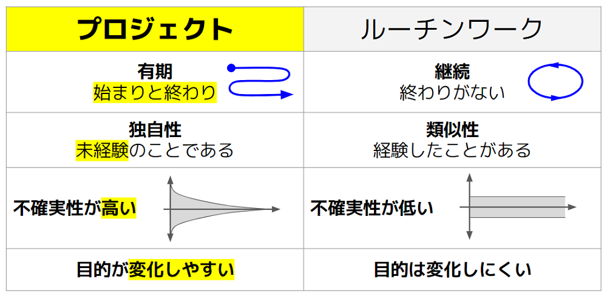

# ミーティングを定例開催にする理由

[ミーティングを設計する](../tutorial/1-3.md)で記述したように、プロジェクトスプリントではミーティングを定期開催とすることが必要です。ここでは、その理由について解説します。

#### **1. 定期的に振り返りを行うことで、プロジェクトを最適化できる。**

不確実性の高いプロジェクトにおいては、マイルストーン達成までの道のりは整然と進むわけではありません。各フェーズの中で、立ち上げ、計画、実行、終結といったそれぞれの段階が重なり合い影響し合いながら進行していくのです。そこで、定期的なミーティングでの振り返りによってメンバー間の認識を都度擦り合わせ、必要に応じて調整を加えることで、プロジェクトを最適化する必要があります。

 （PMBOKの概念を参照）

#### **2. 前回のミーティングから今回のミーティングまでの差分をキャッチアップする機会を保証できる。**

プロジェクトはルーチンワークと違って不確実性が高く、目的も変化しやすいものです。社会や組織の変化が激しいなかでも、定期的に集まることで、各チームメンバーが経験したこと・変化を確実に、定期的に吸収することができます。これらをインプットするからこそ、プロジェクトのゴールやマイルストーンをみんなで合意して変化させることも可能になります。

**プロジェクトとルーチンワークの違い**

#### **3. チームメンバーのスケジュールの調整コストが低くなる。**

社内外の多様なメンバーが参加するようなプロジェクトも多い昨今では、都度スケジュール調整をしているとそれだけで時間がかかります。そのため、あらかじめスケジュール設定をしておく方が効率がよいのです。また都度ミーティングを調整していると必要なタイミングでミーティング開催ができません。これは、必要十分な参加者が一度に集まって素早く効率的に意思決定をするというプロジェクトスプリントの利点を損ねてしまいます。

#### **4. 同じ曜日・時間に開催されることで、他のチームの人が共有のために覗きに来やすくなる。**

あるアジェンダアイテムについて特定のゲストを呼び、スペシャリストとしてのコメントをもらうといったことはよくありますが、定期的な時間・曜日があらかじめ設定されていると都度の調整が必要なく、すでにある時間に招待すればよいため、効率的です。

#### **5. 定期的に期間を区切るほうがタスクの粒度を作りやすい。**

定期的な期間、例えば「1週間でできること」という基準となる間隔をもつことで、これぐらいのタスクであればできるかな、という予測がしやすくなります。現実的なタスクを作成することは、アウトプットを確実につくること、ひいてはアジェンダの確度を上げることにつながります。個々人のアクティビティであるタスク実行をプロジェクト全体の成果に反映させるプロセスを定期的に繰り返すことによって、プロジェクトが最適化されていきます。

#### **6. 定期開催とすると業務のリズムをつくりやすいのでタスクが消化しやすくなる。**

例えば毎週月曜日はこのミーティングがあるのでこういう作業時間を確保しておこう、など。個々のメンバーが作業計画を立てやすくなります。

#### **7. 定期的なプロジェクトの記録になる。**

会議のアジェンダ、議事録、タスクの進捗報告が定点観測的に残ります。これは振り返りの際に参照しやすいログとなるほか、新しいメンバーが参加した際の読みやすさも担保します（過去の情報をむやみに読むよりは、定期的に出力されたものをマイルストーンに沿って読むほうが理解しやすいため）。また、こうしたログが残っていれば、別のプロジェクトを開始する際、過去のプロジェクトがこのようにすすんだのだという参考やひな形にしやすくなります。
