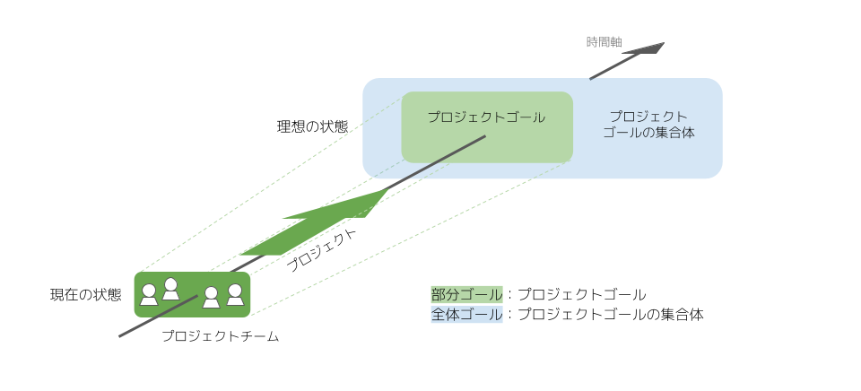
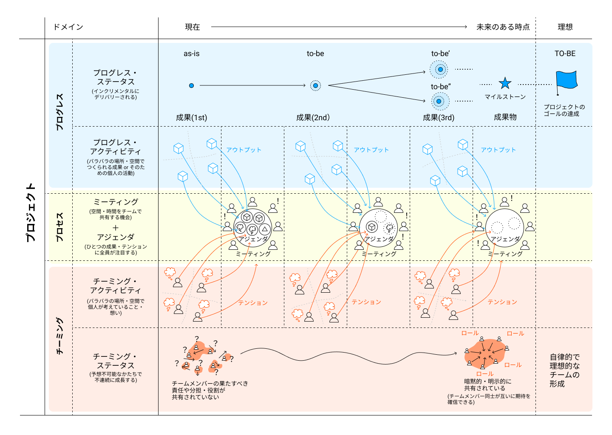

# Project Sprint 101

Project Sprintは、プロジェクトチームがプロジェクトゴールを設定したりプロジェクトゴールに向かって進んだりするのを助けるために、ものごとの捉え方・考え方や、最適化を促進するための仕組みを提供します。

Project Sprintの基本のメカニズムは、「定期的・反復的なミーティングで各メンバーの取り組みの成果や作成物を共有し環境に対する認識を揃えることによって、各メンバーが同じプロジェクトゴールを目指して自律的に各自の次の行動に向かうことができるようにする。この繰り返しがプロジェクトを現在の状態から理想の状態に漸進的に近づけ、結果としてプロジェクトゴールが達成される。」というものです。

ここでは、このメカニズムをうまく取り入れるためのコアとなるアクションとその前提を説明し、Theories及びPracticesにおける個別のドキュメントの内容を理解しやすくします。

### 前提

* プロジェクトは、変化しつづける環境と目的に常に追随するための小さな実験である。
  * プロジェクトとは、「全体」としての課題に取り組む過程のうち、現状のプロジェクトチームで推進・達成に現実味が持てる「部分」を切り出したものである。
  * プロジェクトゴールは、「全体ゴール」の達成に寄与する「部分ゴール」である。

* プロジェクトは、プログレス、チーミング、プロセスの3要素からなる。
  * プログレスは、プロジェクトの成果物やゴールにフォーカスした活動である。
  * チーミングは、チームメンバーの関係性にフォーカスした活動である。
  * プロセスは、プロジェクトチームがプロジェクトゴールに向かって進んでいくための手続きにフォーカスした活動である。

* プロジェクトには、プロジェクトチームとプロジェクトゴールが不可欠である。
  * プロジェクトチームは、プロジェクトゴールに対する共通認識をもち、その達成に向けて相互に協力し合うメンバーの集まりである。
    * プロジェクトチームの役割は、よりよい形でプロジェクトゴールに向かっていくために、個々のメンバーの活動の前提を与えることである。
  * プロジェクトゴールは、プログレスゴールとチーミングゴールから成り、いずれもプロジェクトチームによって定められる。
    * プログレスゴールとは、プロジェクトの成果として目指すべき状態が達成されたり作成物が出力されたりすることである。
    * チーミングゴールとは、相互に期待値を共有し合う自律的なプロジェクトチームが形成されることである。
* プロジェクトチームがプロジェクトゴールに近づくために最も重要なのは、ミーティングとそこにおけるアジェンダの議論である。
  * ミーティングとは、チームメンバーが一時的に同一の環境に固定されてリアルタイムで会話をすることにより、素早く効率的な認識合わせと、全員にとって納得感のある意思決定をする場である。
  * アジェンダとは、個人から出力されたアイデアや問題を、他のメンバーと共有し次の行動を決定するために明文化したものである。
* プロジェクトの理想の状態とは、次に述べるコア・アクションがプロジェクトチームとしても個人としても円滑に実行され、プロセスがサイクルとして繰り返されている状態である。

### コア・アクション

* プロジェクトチームは、自身の意思を反映させたプロジェクトゴールを設定し共有する。
  * そのために、ミーティングで環境への認識を揃え、各メンバーが納得できるプロジェクトゴールを設定する。
  * その結果、各メンバーは個人としてプロジェクトゴールに対する納得感と達成への現実味を持ち、自律的にアクションできる。
* プロジェクトチームは、メンバー間で各々の期待値に対する共通認識を持ち、チームにおける自身の役割や責任に納得してプロジェクトに取り組む。
  * そのために、自身の役割や他のメンバーへの期待をミーティングで共有し認識を揃える。
  * その結果、各メンバーが自分はチームのために何をすべきかを自律的に判断し実際にアクションできる。
* プロジェクトチームは、作成物を生み出すことにより、自ら設定したプロジェクトゴールに向かい漸進的に進む。
  * そのために、各メンバーが作成物の出力に取り組み、その中で他のメンバーに伝えたいひらめきや違和感に出会う。
  * その結果、ミーティングのアジェンダとして提出された各メンバーのひらめきや違和感をもとに、プロジェクトチームとしての意思決定が行われ、それを前提に各メンバーが自律的にさらに次のアクションに向かうことができる。
* プロジェクトチームは、プロジェクトゴールに向けた進捗や全体像を常に見直し、継続的に改善を行う。
  * そのために、プロジェクトを一定の期間で区切って定期的・反復的なミーティングを実施する。
  * その結果、環境の変化に応じ、納得感と共通認識を持ってプロジェクトやプロジェクトゴールを再定義し、適切な軌道修正をすることができる。
