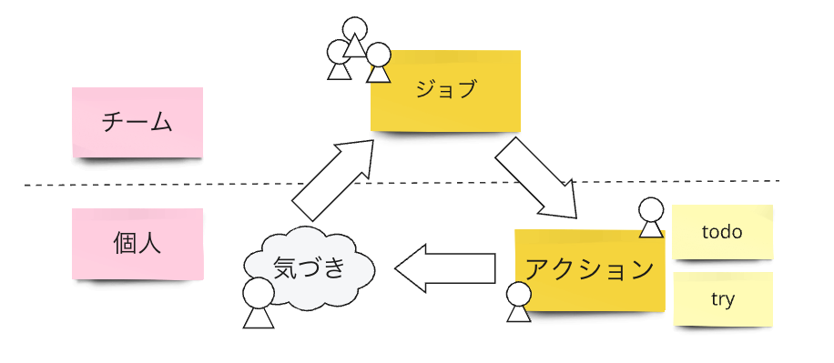

# ジョブとアクション

## ジョブとアクションとは

ジョブ：プロジェクトにおいて達成されるべき事項  
アクション：ジョブを実現するための、作成物の生成を伴う身体的な行動

ジョブとは、「達成されるべき」、つまり達成することがプロジェクトの推進や改善に何らかの形で寄与するであろうとチームが信じる事項である。また、アクションとは、このジョブを実現するためにチームメンバーが取る具体的な行動であり、「作成物の生成を伴う」、つまりチームが受け取ることのできる何らかの有形的なコミットメントをなすことが重要である。

アクションに類似する概念は多くの場合、「やるべきこと」を意味する「タスク」などの語としてジョブに類似する概念とひとまとめにして語られるが、Project Sprint では、このアクションをジョブとフラクタルな（ジョブに包含される）ひとつの活動と捉える。

ジョブの設定にはチームの期待が反映され、アクションの設定には実行メンバーのコミットメントが反映される。同じ目的を共有しつつ別個の視点から表現されたジョブとアクションを見比べることで、チーム内での認識の齟齬を発見・解消しやすくすることを狙いとする。

プロジェクトに取り組む中でなんらかの気づきを得たメンバーは、それをチームでの対話の場に持ち込み共有する。それまで個人のものでしかなかった気づきは、対話を通してチームのものとなり、チームの納得[^1]を得たジョブへと昇華される。

チームによりジョブが設定されると、個々のメンバーがアクションを引き受け実行する。アクションを実行する中でまた新たな気づきが生まれ、次のジョブの源となる。

何をチームとして共通了解をもつジョブとし、何を個人の行動に委ねるアクションとするかは、プロジェクトの置かれている状況やチームのもつ情報によって変わるため、ジョブの目的や、ジョブがチームでの対話の場で議論されるに至った背景・経緯を踏まえて判断する必要がある。

### アクションをジョブと別個に表現することの効果

アクションを実行するメンバーは、アクションの内容と、そのアクションに対してどのようなコミットメントを行うかを宣言する。そのことにより、ジョブとアクションを見比べながら協働のためのコミュニケーションを取ることが可能になり、チームの期待と実行メンバーのコミットメントの齟齬を早期に発見して軌道を修正することができる。

アクションはジョブの目的に追随して設定されるため、ジョブとアクションは同じ目的を共有する入れ子状の2要素であると言える。多様なメンバーから成るチームにおいて、同じものを見ていても個々のメンバーの解釈はそれぞれ異なり、完全に共通の認識をもつということは不可能である。また、ひとつのものに焦点が当たっている場合より、二通り表現されたものを見比べて考えるほうが、齟齬には気づきやすい。チームからの視点と実行者側からの視点を敢えて別個に表現するのはこのためである。別個に表現することで、プロジェクトの一部としてのタスクの目的を達成するうえで致命的な問題となりうる認識の齟齬を、予め解消することができる。

### 個人の気づきをチームで共有し、ジョブをチームのものとして設定することの効果

気づきからジョブを生むという流れを作り出すことで、個々のメンバーによって着想された気づきが、チームに供給されつづけるようになる。共有された気づきは、プロジェクトを推進したり改善したりするための材料となる。

気づきを着想したメンバーにとっては、チームによる助言プロセス[^2]を経て自身の仮説を見直した上で、チームのものとしてジョブが設定されることによって、自身の違和感をチームを主語として解消できると感じたり、自身の気づきがプロジェクトの推進や改善に貢献していると感じたりできるという効果がある。

ジョブから生まれたアクションを実行するメンバーにとっては、自身のアクションが常にチームの期待を受けたものとして意識されるので、プロジェクトにコミットしていると感じやすくなる。そのことにより、各実行メンバーがプロジェクト全体のことを考え、必要に応じて見直しや適切な支援を求めながらアクションを実行できるようになる。

また、気づきを共有してタスクを生み出すプロセスをチームで行うことで、ジョブ同士の重なりや依存関係がないかをチーム全体で確認でき、ジョブ同士が疎である適正な状態を実現できる。

加えて、ジョブの設定を通してチームの期待が個人の行動の前提として明示されることで、その先に生まれるアクションがチームの期待から逸脱しにくくなる。このことで、周囲のメンバーがアクションの影響をある程度予測し、チーム全員が互いに疎な状態で次の行動をより自律的に決定できる。

## アクションタイプ - todo と try

ジョブに紐づくアクションを割り振る際や引き受ける際、チームからの期待と実行メンバーのコミットメントはできるだけシンプルに、かつ認識のずれの生じない語彙で表現できることが望ましい。Project Sprint では、アクションに todo と try という2つのタイプを設定し、それらをチームメンバー間の共通語彙とすることで、個々のアクションに対する認識ずれの早期発見と擦り合わせをよりスムーズにすることを目指す。

todo：具体的な完了の定義に対する共通認識がチーム内に明確に存在し、実行メンバーがその完了の定義に到達しないとチームに成果をもたらせないアクション
try：実行メンバーが探索的に取り組んでなにかを発見すること自体がチームからの期待であり、事前に想定した完了の定義に到達しなくてもチームに何らかの成果をもたらすことができるアクション

※ todoの定義に当てはまらないアクションはすべてtryとして扱うため、tryに分類されるアクションの内容にはグラデーションが存在する。

| - | todo | try |
| ---- | ---- | ---- |
| 期日 | 決定されている | - |
| 完了の定義 | 揺らぎがない（決定されており、変更を前提とせず、メンバー間での認識のずれがない） | 仮説として置かれていることもある |
| チームの期待 | アクションが完了の定義通りに完遂されること | 探索的にアクションが開始されなにかが発見されること |
| 実行メンバーの コミットメント | 完了の定義を達成すること | 何らかの作成物を出力し、その過程で気付きや違和感を得てチームに共有すること |

### アクションタイプを明示することの効果

このアクションタイプを用いて会話することで、実行メンバーのコミットメントがチームに明示され、アクションの工数や結果がチームの想定と大きく異なるのを未然に防ぐことができる。try の場合は当初設定される完了の定義が仮説的であるため、異なる結果が出力されることもあるが、try 的なアクションであることが事前に分かっていれば、チームに生じる混乱も少なくなる。実行メンバーの行動の変更可能性や変更の程度をチームが予め把握することで、実行メンバーの行動が周囲に与える制約や要件が見えやすくなり、周囲のメンバーもそれを踏まえてより自律的に行動できるようになる。

また、チームが実行メンバーに対してアクションタイプを明示して依頼する場合、実行者はチームが自身に対してどのような期待をもっているかを正しく理解してアクションを引き受けることができる。

[^1]: ここでいう「納得」とは、ジョブの詳細な内容に対する納得ではなく、チームとして当該ジョブを実行するにあたっての損失を許容可能だと判断し、ジョブの目的にかなうアクションを実行することに納得しているということである。これは、大元の気づきを得た個人がジョブの実行によってプロジェクトが前進すると信じていることを前提としている。
なお、ここでの考え方は、エフェクチュエーションにおける「許容可能な損失」の概念を参照している。

[^2]: ティール組織の「助言プロセス」の概念を参照している。
