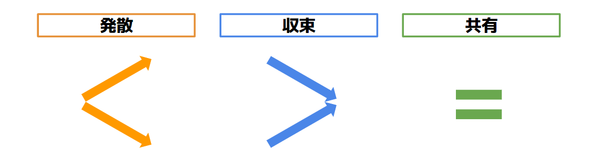

# アジェンダの目的

[Project Sprint 101](../tutorial/project-sprint-101.md)で述べたように、プロジェクトスプリントにおけるアジェンダとは「プロジェクトにおけるチームメンバーの活動を、他のメンバーと共有・認識してもらうために明文化されたもの」の集合のことを指しています。そして、具体的なアジェンダアイテムの作成方法は、[ミーティングの準備をする](../tutorial/2-1.md)や[アジェンダアイテムに含まれているとよい全要素](3-2-2.md)で説明しました。

この記事ではアジェンダをさらに深く理解するために、アジェンダアイテムの目的について解説します。

アジェンダアイテムは、議論の目的によって次の三つの種類に分けられます。

* 発散：議論を通して幅広い選択肢が出てくる。結論が見えないテーマについて議論し、明確でないまま終了してよい。
* 収束：議論を通していくつか選択肢から一つの選択肢に絞られる。メンバー間での意思決定や合意形成など、最終的に何かしらの結論を出す。
* 共有：情報共有や前提確認など、チームメンバーと認識を合わせる。議論を特に必要としない。

個々のアジェンダアイテムがどれに分類されるのかあらかじめ示しておくことで、ミーティングの参加者が「どのような視点で」「どのような発言をするべきか」を理解することができます。例えば、「発散」のアジェンダアイテムであれば自由に意見を発してよく、新しいアイデアを出すことが重要だと分かります。反対に「収束」のアジェンダアイテムであれば、マイルストーン達成のためにどのようなアウトプットをつくっていくべきか、現実的な結論を導くことが必要だとわかります。さらに「共有」のアジェンダアイテムであれば、疑問点を質問しできるだけ認識を合わせることが重要だと分かります。
