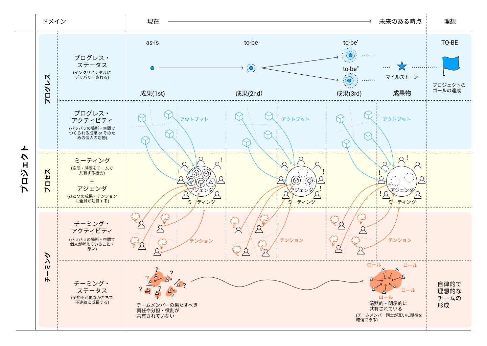

# Project Sprint 101

この記事では、プロジェクトスプリントの概要を説明し、「準備しよう」「やってみよう」「改善しよう」における個別のドキュメントの内容を理解しやすくします。

プロジェクトスプリントとは、多様性のあるメンバーが、不確実性の高い環境や状況でも複雑なアウトプットを可能にするための「プロジェクト推進メソッド」です。

プロジェクトスプリントでは、プロジェクトを推進するための活動を3つに分けて考えます。

**プロジェクトスプリント概念図**

* プログレス：プロジェクトの成果物やゴールにフォーカスした活動
* プロセス：プロジェクトを推進させるための手続きにフォーカスした活動
* チーミング：チームメンバーの関係性にフォーカスした活動

プロジェクトスプリントの基本のメカニズムは「プロセスによって、プログレスとチーミングを理想の状態にする」というものです。では、プログレスとチーミングの「理想の状態」とはいったいどういうものなのでしょうか？

プログレスの「理想の状態」とは、プロジェクトのゴールが達成されている状態です。そのため、まずは将来達成したいプロジェクトのゴールを定義します。そして、そのために必要な成果物と、成果物をつくっていくための道のり（これを、マイルストーンと呼びます）を設定し、これを辿っていきます。ただし、プロジェクトのゴールやマイルストーンは絶対のものではなく、むしろ環境の変化に応じて柔軟に変わっていくものなので、常に見直してよいものだと考えておく必要があります。

一方チーミングの「理想の状態」とは、チームメンバー同士の果たすべき役割（これを、ロールと呼びます）についての期待値がそろっている状態です。言い換えると、あるチームメンバーが「あの人はこれをやってくれるだろう」と考えたとき、そのチームメンバーも「これは私がやるべきことだ」と考えている状態です。チーミングの「理想の状態」には、明確な形がありません。なぜなら「ここまで達成したら理想のチームだ！」というものが決めにくいからです。そこでプロジェクトスプリントでは、「今の時点よりは良いチームの状態」を常に目指します。

プログレスとチーミングの理想の状態を実現するためのものが「プロセス」です。

プロセスは定期開催のミーティングとそこでのアジェンダの議論を軸としています。

プロジェクトスプリントでは、ミーティングを、「チームメンバー全員が空間や時間を共有し、素早く効率的な認識合わせと、全員が納得した意思決定をする場」として、またアジェンダを「プロジェクトにおけるチームメンバーの活動を、他のメンバーと共有・認識してもらうために明文化されたもの」として位置付けています。

これらを通じてプロジェクトの進捗状況の共有・プロジェクトの進め方の継続的な改善・プロジェクトのゴールに向けたマイルストーンの見直しや互いのロールの確認をすることができるようになります。
