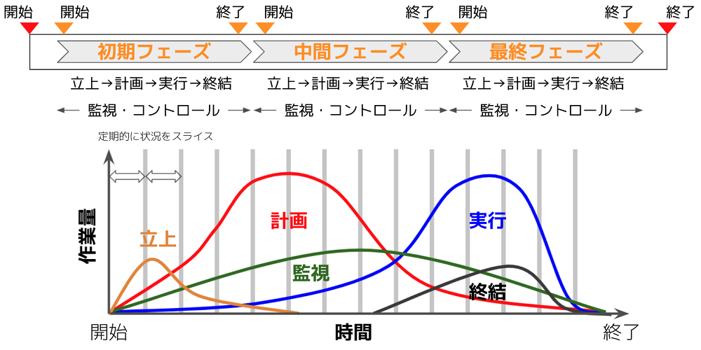

# ミーティングを設計する

プログレスとチーミング双方において、プロジェクトチームがプロジェクトゴールに向かって円滑に進んでいくための仕組みがプロセスであり、その軸となるのは、チームでのミーティングとそこでのアジェンダの議論です。個々人がタスクに取り組む中で生まれた作成物やアイデア・問題・テンションをミーティングで共有し認識を揃えることによって、プロジェクトチームとしてのアイデアを共同創造し、問題の共同解決を行って次の行動を決定することが重要です。

ここではそのミーティングの設計について記述します。

### **「ミーティング」とは**

Project Sprintでは「ミーティング」を、「チームメンバーが一時的に同一の環境に固定されてリアルタイムで会話をすることにより、素早く効率的な認識合わせと、全員にとって納得感のある意思決定をする場」と位置づけています。

リアルタイムで全員が集まるミーティングが、プロジェクトの意思決定においては最適な選択です。変化の激しい時代にあって、メールやチャットでの非同期のコミュニケーションでは、個々のメンバーが時間軸も視界も異なる環境に置かれることになるため認識に齟齬が生じやすく、意思決定が困難になります。リアルタイムで集まることでまず、チームメンバー全員が同じ時間軸に固定されます。そして会話する中でお互いの視界にある景色を擦り合わせて初めて認識が合い、大きな意思決定を行ったりそれに対して納得したりすることができるようになるのです。

これを実現するために、ミーティングを適切にデザインし、プロジェクトメンバーで合意しましょう。

### **ミーティングの設計**

ミーティングは定期的・反復的に開催される必要があります。この理由については、詳しく後述します。

ミーティングの開催頻度は、週次/月次/隔週など、プロジェクトの性質やチームメンバーの人数などを勘案して任意に決めてください。ただし、Project Sprintの基本のメカニズムが「定期的・反復的なミーティングで各メンバーの取り組みの成果や作成物を共有し環境に対する認識を揃えることによって、各メンバーが同じプロジェクトゴールを目指して自律的に各自の次の行動に向かうことができるようにする。この繰り返しがプロジェクトを現在の状態から理想の状態に漸進的に近づけ、結果としてプロジェクトゴールが達成される。」であることを考えると、隔月以上の間隔でのミーティング開催は考えにくいでしょう。

ミーティングに目的や完了の定義が明確に存在しうることもありますが、基本的にはミーティングは目的も到達すべき地点も持たず、その時々のアジェンダアイテムが投入されていく連続した箱のようなものと捉えるのがよいでしょう。ミーティングで議論すべきアジェンダの内容や性質は常に異なるため、どのようなアジェンダでも自由に提案できるよう、なるべく縛りを設けないでおくのです。

なお、各ミーティングの参加者はアジェンダに応じて必要十分な程度でかまいません。ここでいう必要十分とは、アジェンダに関して網羅的に議論でき（＝「誰かがいないから今日はこの話ができないね」ということがないようにする）、また議論をもとに正式な意思決定ができること（＝「誰かがいないから今日はこの話は決まらないね」ということがないようにする）を意味しています。もし参加人数が大人数(10人を一つの目安としてください）になっている場合は、必要以上の人数を集めていないか、確認してください。もしそうなってしまっている場合、アジェンダの議論と意思決定を目的としたミーティングではなく、単なる情報共有を目的とした会議になっている可能性があります。

とはいえ、ミーティングでは多様なアジェンダが提出される可能性があるので、最初にミーティングを設計する際には、あらかじめチームメンバー全員が集まることのできるミーティングを設定したほうがいい場合も多いでしょう。そうすることで、チームメンバー個々人の中にとどまっている情報を一斉に共有することができ、各チームメンバーはこのプロセスに参加するだけでプロジェクトの状況や思っていることについて自然と認識を合わせることができるようになります。

さらに、参加者が漏れなく参加でき、情報をリアルタイムに共有できるようなミーティング環境を整備するようにしてください。これは、前述の素早く効率的な認識合わせを実現するために重要なポイントとなります。具体的には、場所を問わず参加できるリモートミーティング環境の準備、その場で決まったことを共有できるドキュメントシェアサービスの利用、などを行うことになるでしょう。

### **定例ミーティングが不可欠である理由**

**1. 定期的に振り返りを行うことで、プロジェクトを最適化できる。**

不確実性の高いプロジェクトにおいては、マイルストーン達成までの道のりは整然と進むわけではありません。各ステップの中で、立ち上げ、計画、実行、終結といったそれぞれの段階が重なり合い影響し合いながら進行していくのです。そこで、定期的なミーティングでの振り返りによってメンバー間の認識を都度擦り合わせ、必要に応じて調整を加えることで、プロジェクトを最適化する必要があります。

（PMBOKの概念を参照）

**2. 前回のミーティングから今回のミーティングまでの差分をキャッチアップする機会を保証できる。**

プロジェクトはルーチンワークと違って不確実性が高く、目的も変化しやすいものです。社会や組織の変化が激しいなかでも、定期的に集まることで、各チームメンバーが経験したこと・変化を確実に、定期的に吸収することができます。これらをインプットするからこそ、プロジェクトのゴールやマイルストーンをみんなで合意して変化させることも可能になります。

**プロジェクトとルーチンワークの違い**

.png>)

**3. チームメンバーのスケジュールの調整コストが低くなる。**

社内外の多様なメンバーが参加するようなプロジェクトも多い昨今では、都度スケジュール調整をしているとそれだけで時間がかかります。そのため、あらかじめスケジュール設定をしておく方が効率がよいのです。また都度ミーティングを調整していると必要なタイミングでミーティング開催ができません。これは、必要十分な参加者が一度に集まって素早く効率的に意思決定をするというProject Sprintの利点を損ねてしまいます。

**4. 同じ曜日・時間に開催されることで、他のチームの人が共有のために覗きに来やすくなる。**

あるアジェンダアイテムについて特定のゲストを呼び、スペシャリストとしてのコメントをもらうといったことはよくありますが、定期的な時間・曜日があらかじめ設定されていると都度の調整が必要なく、すでにある時間に招待すればよいため、効率的です。

**5. 定期的に期間を区切るほうがタスクの粒度を作りやすい。**

定期的な期間、例えば「1週間でできること」という基準となる間隔をもつことで、これぐらいのタスクであればできるかな、という予測がしやすくなります。現実的なタスクを作成することは、アウトプットを確実に作ること、ひいてはアジェンダの確度を上げることにつながります。個々人のアクティビティであるタスク実行をプロジェクト全体の成果に反映させるプロセスを定期的に繰り返すことによって、プロジェクトが最適化されていきます。

**6. 業務のリズムを作りやすくなり、タスクの消化がスムーズになる。**

例えば毎週月曜日はこのミーティングがあるのでこういう作業時間を確保しておこう、など。個々のメンバーが作業計画を立てやすくなります。

**7. プロジェクトの定点観測資料になる。**

ミーティングのアジェンダ、議事録、タスクの進捗報告が定点観測的に残ります。これは振り返りの際に参照しやすいログとなるほか、新しいメンバーが参加した際の読みやすさも担保します（過去の情報をむやみに読むよりは、定期的に出力されたものをマイルストーンに沿って読むほうが理解しやすいため）。また、こうしたログが残っていれば、別のプロジェクトを開始する際、過去のプロジェクトがこのようにすすんだのだという参考やひな形にしやすくなります。
