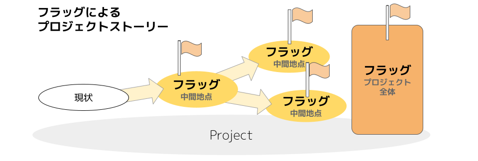
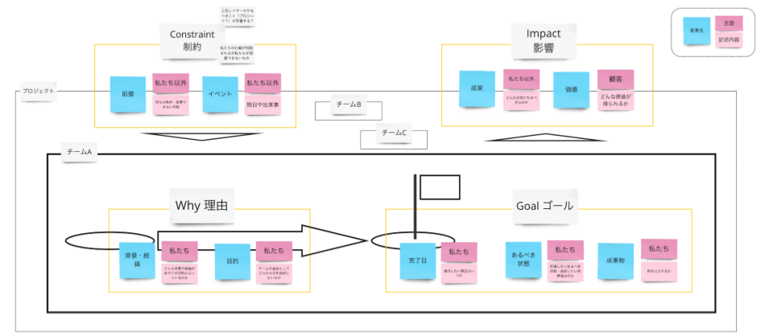

# Framework

## 1. Project Sprint は何を可能にするか

Project Sprint は、プロジェクト推進のためのフレームワークです。最大の狙いは、定例会議の活用によって、チームメンバーの行動を習慣化することです。

定例会議を設定することにより、プロジェクトにリズムが生み出されます。チームの行動はこのリズムによって習慣化され、プロジェクトの推進や見直しが習慣的・継続的に行えるようになります。

また、環境の変化の激しい時代において、プロジェクトはより複雑になり、プロジェクトチームの構成はより多様になっています。このような状況下でよりよい成果をもたらすには、各メンバーが自律的に活動できることが重要です。

そのためにProject Sprint は、個々のメンバーの活動ができる限り疎結合であることを目指します。疎結合であることにより、各メンバーが自分の行動を自分で決定できるようになるからです。

疎結合でありながら一体感のあるチームとしてプロジェクトを推進していくためには、チームでの共通了解が必要です。定例会議はこの共通了解の形成にも活用されます。共通了解は、各メンバーが行動を自己決定する際の前提や判断材料となります。

## 2. Project Sprint が理想とする状態

プロジェクトは、個々のチームメンバーが作成物を出力しつづけることで推進されます。そのため Project Sprint では、

|チームメンバーの自律的な活動により、プロジェクトの目的達成を目指した作成物が出力されつづけている状態|
:-|

を、プロジェクトチームの理想的な状態と定義します。

Project Sprint のフレームワークは、プロジェクトチームが環境の変化に応じてプロジェクトを変化させながら、目的に沿った作成物を生み出しつづけられるようにすることを目指しています。

## 3. プロジェクト推進の構造

### 3.1 出力と対話の反復

プロジェクトを推進するにあたってもっとも重要なのは、各メンバーによる作成物の出力です。そして、その出力に方向づけや意味づけを与えるのが、チームでの対話です。この出力と対話の反復によって、プロジェクトは推進されます。

* **出力：各メンバーが自律的に活動して作成物を生み出すこと** :&#x20;
  1. 各メンバーが、納得をもって自律的に行動を起こす
  2. 身体的な行動で具体的な作成物を出力し、その過程で多様な気づきを得る
  3. 作成物自体やその出力に伴って得られた気づきを材料に、次の対話に向けて準備をする

* **対話：チームで集まって状況を把握し、各々が次の出力に向かうことができるようにすること** :&#x20;
  1. 各メンバーが、タスクの実践を通して出力された作成物と得られた気づきをチームに共有する
  2. チームとして環境を固定して現状認識を共有した上で、アイデアの共同創造や問題の共同解決を行い、プロジェクトの方向性に対する共通了解を形成する
  3. チームの共通了解を前提として、各メンバーが次の対話までにどう行動すべきかを自覚し納得できるようにする

この出力と対話の反復をスムーズにするために、Project Sprint には以下の3つの仕組みがあります。

### 3.2 仕組み① 定例会議でパターンとリズムをつくる

Project Sprint の軸となるのは、上で述べた対話をプロジェクトのタイムラインに定期的に出現させること、つまり**定例会議**を設定することです。短い一定のタイムスパンで、同一のプロセスでの処理を繰り返すことで、各メンバーが自律的に行動できる環境と習慣をつくりだします。

定例会議は、以下の3つの条件を満たしていなくてはなりません。

* 短期的: プロジェクト全体のスケジュール感から見て相対的に短期であること
* 定期的: 人間の既存の習慣に沿った一定の期間が置かれること（日次、週次、隔週等）
* 反復的: 一定の型が存在すること（進行方法、アジェンダの種類や形式等）

定例会議を置き、決められたタイムスパンの中で反復的に行動することで、プロジェクトに一定のリズムが生まれます。そのことには、以下のようなメリットがあります。

* 生産性が向上する（作成物生成の期日が明確化される）
* 計画しやすくなる（過去の実績を判断材料にすることで、タスクの粒度を揃えたり作業計画を立てたりしやすくなる）
* 分析して改善しやすくなる（行動が習慣化される）

Project Sprint における定例会議の仕組みは、各メンバーの行動を習慣化させるものです。各メンバーに習慣的行動が根付くことによって、作成物が定期的・反復的に生み出されつづけ、それがプロジェクトを推進したり見直したりする材料となるのです。

また、会議の進行方法やアジェンダの型を決め、それに沿って定期的に対話することも重要です。これには以下のようなメリットがあります。

* チームが納得した意思決定をしやすくなる（全員の環境を一時的に固定して認識を揃える）
* プロジェクトを観測しやすくなる（定点観測で状況を理解しやすくなる）
* 分析して改善しやすくなる（反復するたびに効率が良くなる）

### 3.3 仕組み② プロジェクトストーリーとロールの共通了解をつくる

プロジェクトにおける**共通了解**とは、対話や議論を通してチーム内で形成され共有されている認識のことです。もちろん、ものごとの認識の仕方はメンバーごとに異なり、まったく同じ認識を共有できるわけではありません。この大前提に立ちながらも、各メンバーがプロジェクトをどのように認識しているかを定期的に確認し、チームとして目指すところを常に調整しつづけることで、統合的な行動が取れるようになります。

出力と対話のサイクルが回っていたとしても、チーム内で環境[^1]の認識にずれが生じていれば、各メンバーの行動はそのプロジェクトに相応しくないものになってしまう可能性があります。そうならないように、以下のような事柄については共通了解を形成しておく必要があります。

* プロジェクトストーリー（プロジェクトチームが何を目指しているかの認識を揃えることで、統合的な行動が取れる）
* チームメンバーの役割・期待（チームの中で自分が何をすべきかを納得することで、自信を持って行動できる）

これらをチームの納得に基づいて設定し共有しておくことは、共通の目的に向かってチームが自律的に行動しつづけるために非常に重要です。

### 3.4 仕組み③ 多様な観点から見直しを行う

定例会議と活動のサイクルが回ることでプロジェクトは常に調整されつづけていますが、必ずしもすべての改善点が洗い出されているわけではありません。また、これまでに述べた2つの仕組み自体を改善していく必要もあります。

Project Sprint では、プロジェクトのすべての領域を定期的に改善することを目指します。そのために用いられるのが、**継続的改善アプローチ**です。チームメンバー全員の目線を使って、プロジェクトをよりよい状態にするべく定期的・継続的に見直し改善しつづけるための仕組みです。

継続的改善アプローチは、フェーズの開始・終了時や大きな変更があったときなど、プロジェクトの成果で区切って行います。ただし、それだけではなく、月次・週次等定期的に見直しを行うことも重要です。

継続的改善アプローチの代表的なアクションは、「定期的に過去の振り返りを実施してアイデアや問題をチームのものとして顕在化し、プロジェクトをよりよい状態にするための改善策を検討する」ことです。しかし、「過去」だけではなく「現在」にも目を向けることが重要です。各メンバーが今現在感じている違和感や閃きを、リアルタイムでアイデアや問題に昇華して共有することが、チームの状況を改善するために不可欠だからです。

「過去」を見る振り返りだけを実施する場合、問題が共有されるのはその問題が起こってしまった後である可能性が高いでしょう。しかし、「現在」を見るようにすることで、問題が顕在化もしくは拡大する前に共有し対処することができるようになります。また、もやもやをタイムリーに解消できる場があることは、メンバーのプロジェクトへの参加意欲の向上にも繋がります。そのため Project Sprintでは、定例会議の中での違和感や閃きの共有という形で、定期的に現在の心境を出し合うことを推奨しています。

### 3.5 すべては作成物の出力から始まる

プロジェクトにおいて重要なのは、**チームメンバーがタスクを実践して作成物を出力する**ことです。

作成物は、各メンバーが個人で実践した活動を、チームで遂行するプロジェクトに統合する際の媒介といえます。言語だけの対話では認識が揃いにくい場合も、具体的に目に見える作成物が対話の場に持ち込まれることで問題意識や課題が共有され、共通了解が形成されやすくなります。出力と対話のサイクルで、個人の活動の結果が他のメンバーの認識を小さく変容させることを繰り返して、プロジェクトチームとしての共通了解が揃ってゆくのです。

プロジェクトの前進につながる作成物が出力されること自体も重要ではあります。しかし、より重要なのは、各メンバーがタスクの実践という具体的な行動を通して、プロジェクトや環境の情報、多様な視点からのひらめきや違和感を得て、それらの気づきをチームに共有することです。こうした気づきがチームに供給されつづけることで、個人の気づきからチームとしての新たなタスクを生み、次の出力につなげるという流れを作り出すことができます。

対話は、個人の活動の範囲内では個人のものでしかなかった作成物や気づきを、チームに共有することでチームのものにするプロセスでもあります。個人の出力による作成物や気づきは、チームのもの、ひいてはプロジェクトのものになることによって成果や価値、プロジェクトの見直しにつながっていきます。

また、対話は、出力に事後的な意味付けを行うという意味でも重要です。各メンバーが自身の行動の意味を前もって正確に理解したり、自己完結的に振り返って評価したりすることは難しいものです。出力の後にチームでの対話を行うことで初めて意味付けがなされ、自分の行動がプロジェクトの中で占める位置や重要性が認識できます。そのことによって得られる納得感が、さらに次の行動を自己決定する際の補助線になるのです。

## 4. 価値と成果の構造

### 4.1 価値

価値とは、プロジェクト外部のステークホルダーが、プロジェクトが実行された結果として、意味や有用性を認識して受け取る便益です。

Project Sprint では基本的に、実現を目指す価値もそのために達成すべき成果も固定的なものではなく、設定時の環境を前提とした可変的なものであると捉えています。プロジェクトチームは小さな実験を繰り返して結果を検証し、環境の変化を捉えて価値や成果を更新していきます。

また、プロジェクトからもたらされる便益に意味や有用性があるかどうかはあくまでステークホルダーの評価に委ねられるものです。そのため、プロジェクトチームが意図し提供する便益と、ステークホルダーの認識する価値にずれが生じることもあります。

この２つの理由から、Project Sprint では、プロジェクトチームがプロジェクトにおける各時点で認識できるのはあくまで仮説的な価値であると考えています。真に価値と言えるかどうかは、ステークホルダーを含む対話を通してのみ検証可能になるのです。

ただし、変化を前提とせず、当初設定した最終ゴールにまったく変更の余地がないという完全にウォーターフォール型のプロジェクトにおいては、プロジェクトチームが価値に関してステークホルダーと共通認識を持つことができます。そのため、この場合においてはプロジェクトチームが認識する価値は真の価値と同一のものといえます。

各メンバーの出力という個人単位の実験については、必ずしも真の価値に関する検証を含む必要はありません。しかし、プロジェクト単位では、最終的に真の価値を提供できたかどうかの検証が必ずなされる必要があります。プロジェクト遂行中に部分納品を複数回行うようなアジャイル型のプロジェクトにおいては、デリバリーごとにステークホルダーからのフィードバックを得ることで、真の価値に関する検証を段階的に行っているといえます。

### 4.2 成果

成果とは、プロジェクト内のチームが、プロジェクト外部のステークホルダーに提供したい価値を踏まえ、プロジェクト内部のステークホルダー（当該成果の達成を担うチーム以外の別チーム）やプロジェクト全体に向けて生み出す所産のことを言います。

プロジェクトチームは、次の行動を決定する指針とするために、目的達成までの過程をプロジェクトストーリーとして表現します。プロジェクトストーリーは各チームのフラッグの集積によって表現され、プロジェクト内外に共有されます。

フラッグとは、チームが外部からの制約や実現したい価値・成果を踏まえ、ある目的をもって設定した到達点です。フラッグは以下のような要素を持ちます。

また、フラッグは以下のようなものでなくてはなりません。

* 外部に依存せず、そのフラッグの達成に責任を持つチーム内で自己完結して行動できるものでなくてはならない
* そのフラッグを達成することが、フラッグの達成に責任を持つチームのみならず、プロジェクト内の他チームやプロジェクト全体に資する（＝成果となる）ものでなくてはならない（後述する成果物やあるべき状態は、当該成果の達成を担うチームを主語として設定されるが、成果は当該成果の達成を担うチームのみに便益を与えるものであってはならない）
* 環境の変化の影響を受けにくいように、開始から達成までの期間は長くとも2か月以内とする
* 直近の2か月程度を完了日とするものは必ず達成するとチームが外部に宣言するコミットメントでなくてはならないが、それ以降を期日とするものは仮説であってよい

フラッグの達成のために設定されるゴールは、プロジェクトやプロジェクト内の一定のフェーズの完了の定義となります。ゴールには、完了日の他に、次の2つの要素が含まれます。

* **あるべき状態** :　その状態に至ることで成果を達成したと判断できる、状態や定性的な捉え方。
  * 誰が何をできる状態なのか
  * ステークホルダーがどんな状態なのか
  * プロジェクトがどんな状態なのか
* **成果物** :　出力・作成されることで成果を達成したと判断できる、有形的なものや定量的な値。
  * 機能が付与されたサービス
  * ボリューム・内容イメージの資料
  * 目標として設定した測定値

ゴールをこの2つの要素両方を用いて表現することで、要素が相互に補完し合いチームの共通了解が形成されやすくなります。この2要素は共通かつ一定の価値仮説と成果を前提に設定され、プロジェクトが推進され完了日が近づいてくるにつれ、段階的に内容が更新されて精度が高まっていきます。

フラッグの各要素もまた、相互に影響を与え合いながら精度を増していきます。成果物やあるべき状態が段階的に精度を高めていくのに伴い、成果や価値仮説も変容することがあります。また、成果や価値仮説が何らかの原因で変容したことにより、成果物やあるべき状態が変容することもあります。

### 4.3 出力

出力とは、チームメンバーが作成物を産出することです。

成果と出力の関係は、次のようなものです。

1. プロジェクトチームは、外部に提供したい価値を踏まえ、実現すべき成果の仮説を立てる。
2. プロジェクトチームは、1で立てた仮説に従って、直近のフラッグを目指して出力に取り組む。
3. それぞれのチームメンバーは、目標を達成するための行動を自律的に設定し遂行する。
4. チームメンバーによる出力は小さな実験として、次の二つのインパクトを持ちうる。
   * 出力に取り組むことで得られた成果が、最終的な成果の実現に貢献する
   * 出力に取り組むことで得られた環境情報が、成果の仮説を更新する材料になる
5. プロジェクトチームは、上のインパクトに従って成果の仮説を更新し、目標やタスクの設定を最適化する。

この関係に則ってプロジェクトに取り組むことにより、プロジェクトチームは変化する環境と目的を捉えつづけながら、最新の仮説に従った成果を生み出すべく行動を最適化することができるのです。

## 5. チームの自律性の構造

Project Sprint においては、プロジェクト内外の変化を素早く捉えつづけることのできる自律的なチームである事が求められます。「自律的」とは、チームメンバーが自発的・主体的に考え、行動ができている状態をいいます。つまり、ある事柄に対して自分がチームのために何をすべきかを各メンバーが判断でき、かつ実際に行動できる状態のことです。

### シェアド・リーダーシップ

Project Sprint では、プロジェクト内外の変化を素早く捉えつづける自律的なチームであるために必要なものとして、シェアド・リーダーシップ[^2]の考え方を取り入れています。

シェアド・リーダーシップとは、プロジェクトがある特定のリーダーの指揮のもとで進むのではなく、メンバー全員がそれぞれ必要なときに必要なリーダーシップを発揮する状態のことを指します。

シェアド・リーダーシップの状態であるためには、**分化**と**統合**が同時に達成されている必要があります。つまり、各メンバーが自らの納得と決定に基づいて自律的・自発的に行動しながら（分化）、チームとしては同じ目標に向かって協調・連携している（統合）状態です。目標の共有によりチームとしての方向性が定まり、それを前提に各メンバーが行動を自己決定できるようになります。

分化的な行動のためには、各メンバーがチームの中での自身の責任や役割を自覚して納得したうえで相互に期待する内容を共有し、自信を持って行動できなくてはなりません。

一方、統合的な行動のためには、メンバーそれぞれがもつプロジェクトに対する認識を定期的に擦り合わせ、チームとして何を目指しているのかを調整しつづけて、協調・連携しながら行動できなくてはなりません。

この分化と統合という一見相反することがらを同時に達成するためには、メンバー間の信頼関係を築くことが重要です。信頼関係が構築されると、

* 失敗を恐れず前向きに行動を自己決定できる　→　分化の促進
* 協力をリスクと捉えず助け合うようになる　→　統合の促進

### 活動がチーミングに与える効果

信頼の構築に最も効果的なのは活動と対話の繰り返し、特に具体的な作成物を生み出してそれをもとに対話を行うことです。個々人の活動の結果を踏まえて対話することで、各メンバーが納得できるかたちでチームとしての認識を揃えていくことができます。

活動、すなわち作成物の出力は、成果を実現したり仮説を変容させる材料を得たりする手段です。しかしそれだけでなく、自身の役割を引き受けてチームへの貢献と誠実さを示すことによって、信頼関係を醸成する手段でもあります。作成物そのものや作成物への取り組み方から、それを生み出したメンバーの経験やスキル、置かれている状況を見て取ることができます。他のメンバーの作成物を率直かつ公正に受けとめることもまた、相互の信頼の構築に大きく役立つのです。

チームメンバー間の信頼関係がベースにあることで、相互の期待に対する共通了解が生まれ、各々が自分の活動を自己決定しやすくなります。各メンバーが自分の持ち場を自己認識し、その場においてリーダーシップを発揮することで、「みんなでプロジェクトを進める」状態が実現されます。

## 6. Project Sprint におけるプロジェクトの認識

Project Sprint においては、便宜上プロジェクトをプログレス、チーミング、プロセスという3つのドメインに分けて認識しています。プロジェクトにおける個々の実践を、これらの3つの側面それぞれから解釈することで、個々の実践がプロジェクトの中で持つ意義や効果をより正確かつ多面的に認識できます。この認識をプロジェクトチームで共有することにより、個々のメンバーは実践に対する各自の具体的な行動を必要に応じて自律的に最適化することができるようになります。

この Framework における以下のセクションは、それぞれのドメインに対応したものです。
3. プロジェクト推進の構造　⇒　プロセス
4. 価値と成果の構造　⇒　プログレス
5. チームの自律性の構造　⇒　チーミング

以下の表は、それぞれの側面における認識のしかたを整理したものです。

|    |  プログレス  |  チーミング  |  プロセス  |
| ---- | ---- | ---- | ---- |
|  何に焦点を当てるか  |  成果  |  チームメンバー相互の関係  |  定例会議  |
|  何を目指すか  |  成果の実現  |  自律的なプロジェクトチームの形成  |  プロジェクトを推進・改善しやすい環境の構築  |
|  どのような観点から プロジェクトを捉えるか  |  最終的な成果を達成するまでの行程を小さな成果の積み重ねに細分化して、軌道修正を繰り返しながら徐々に達成する  |  メンバー相互の信頼関係をベースに、チームの一貫性と個人の自律性をもちチーム全員で進める  |  定例会議を起点にした環境構築により実験とフィードバックのサイクルを習慣化・活性化させ、プロジェクトやプロジェクトチームの状態をよりよくする  |
|  重視される実践  |  成果の進捗・達成 成果の仮説の設定と更新  |  価値・成果の認識共有と納得 各自の責任・役割の自覚と引き受け |  各自の出力による作成物やアイデアの共同創造 定例会議での問題の共同解決  |
|  重視される価値観  |  **反復的・漸進的**な成果の実現 環境の変化への**能動的な追従**  |  メンバー相互の**信頼関係**の構築 **チーム全員によるプロジェクト推進**  | 各メンバーの**自己決定**による自律的な行動 **定期的・反復的**な同期、**継続的・漸進的**な改善 |

[^1]: ここでいう環境とは、プロジェクトやメンバーの状況はもちろん、プロジェクトの外部にある社会や組織など、プロジェクトやメンバーに影響を及ぼすすべての要素を含む。環境の変化がどのようにプロジェクトに影響を及ぼすかは、メンバーの感知・解釈によって決定される。

[^2]: 本セクションの記述に当たっては、以下の書籍を参照している。

    石川淳（2016）「シェアド・リーダーシップ：チーム全員の影響力が職場を強くする」中央経済社
